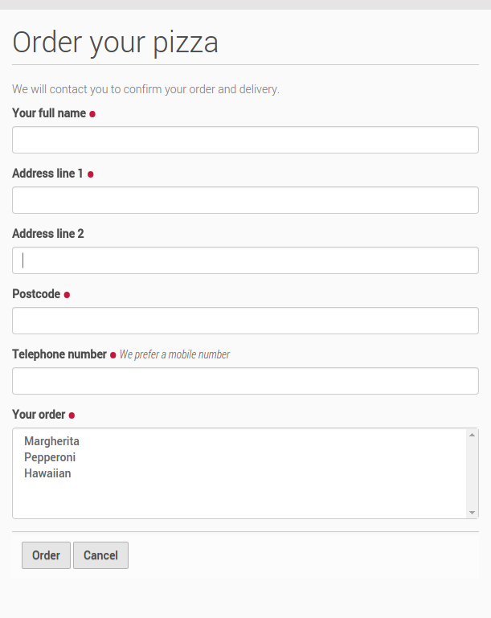

Testing the form
=====================

**Seeing the form in action**

The schema and (grokked) form view is all that’s needed to create the
first iteration of the form. We can now install our new package and test
the form.

First, we make sure that we have run *bin/buildout* so that the new
package is available to the Zope instance script. We then start up Zope
in foreground mode:

::

    bin/instance fg

Next, we create or go to a Plone site, and install the new *Example
forms* product via the new Plone site creation form or the Add-ons
control panel. This should also install the product called *Plone
z3c.form support* (from the *plone.app.z3cform* package) as a
dependency.

We haven’t created any links to the form yet (though you could do
so in a content item or portlet by inserting a manually-entered URL),
but the form can be visited by going to the *@@order-pizza* view on the
Plone site root, e.g.:

    *http://localhost:8080/Plone/@@order-pizza*

It should look something like this:

Try to fill in the form and use the two buttons. You should see the
validation (both on-the-fly and after submit if you ignore the
on-the-fly warnings), as well a message printed to the console if a
valid form is submitted when clicking the *Order* button.

Remember: We have worked so far in a development environment of the
package itself. Now you want to insert example.form to your project's
buildout. It should look just similiar to the packages buildout.

.. code-block:: ini

    [buildout]
    extends = http://dist.plone.org/release/5.0-latest/versions.cfg
    extensions = mr.developer
    parts =
        instance
        test
        code-analysis
        releaser
    develop = src/example.form

    [instance]
    recipe = plone.recipe.zope2instance
    user = admin:admin
    http-address = 8080
    eggs =
        Plone
        Pillow
        example.form [test]

    [code-analysis]
    recipe = plone.recipe.codeanalysis
    directory = ${buildout:directory}/src/example
    flake8-exclude = bootstrap.py,bootstrap-buildout.py,docs,*.egg.,omelette
    flake8-max-complexity = 15
    flake8-extensions =
        flake8-blind-except
        flake8-debugger
        flake8-coding

    [omelette]
    recipe = collective.recipe.omelette
    eggs = ${instance:eggs}

    [test]
    recipe = zc.recipe.testrunner
    eggs = ${instance:eggs}
    defaults = ['-s', 'example.form', '--auto-color', '--auto-progress']

    [robot]
    recipe = zc.recipe.egg
    eggs =
        ${test:eggs}
        plone.app.robotframework[debug,ride,reload]

    [releaser]
    recipe = zc.recipe.egg
    eggs = zest.releaser

    [versions]
    setuptools = 18.0.1
    zc.buildout = 2.2.5
    zc.recipe.egg = 2.0.1

    flake8 = 2.3.0

    robotframework = 2.8.4
    robotframework-ride = 1.3
    robotframework-selenium2library = 1.6.0
    robotsuite = 1.6.1
    selenium = 2.46.0

    [sources]
    example.form = fs example.form
