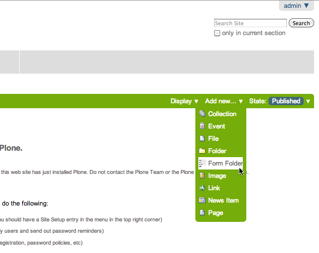

=================================
Getting Started with PloneFormGen
=================================

.. admonition:: Description

    Learn the basics of creating web forms with PloneFormGen

Introduction
===============

:doc:`Please read general PloneFormGen information first </working-with-content/managing-content/ploneformgen//index>`

Getting Started
===============

.. note::

    The best place to start for non-technical Plone users.

To get started building a custom form using PloneFormGen, you must first create a **Form Folder**. A form folder is a lot like a normal Plone folder - you use it to organize and hold other types of content. The Form Folder also has some settings of its own that will control the behavior and appearance of the form.

Click *Add Item* and choose Form Folder from the drop-down menu.

Create the form
---------------

Provide a *Title* and *Description* for the form. You can also change the wording of the *Submit* or *Reset* button if you wish.

Ignore the rest of this edit screen for the time being and just click *Save* at the bottom.

.. image:: creating-the-form-title-description.png
   :alt: screenshot: Creating the form

Form Folder Settings
====================

.. admonition:: Description

    Learn how to configure your form.

You now have a basic form to work with. By default, a form starts with *E-Mail Address*, *Subject* and *Comments*. These are fields you get automatically, every time you create a new form.

.. image:: basic-form.png
   :alt: screenshot: Basic form

Adding text to the form
-----------------------

Before you learn how to add new fields, or change existing ones, let's look at how you can add some simple text above and below the form.

You may want to include instructions to your site visitor about how to fill out your form, or what the purpose of the form is supposed to be. You can add that descriptive text as follows:

* Edit the Form Folder by clicking on Edit in the taskbar

* Now you'll see two Body Text areas called Form Prologue and FormEpilogue (which means before and after). Use the text editor to format your content, include links, and even pictures. Click Save when you're all done.

.. image:: prologue-epilogue.png
   :alt: screenshot: prologue and epilogue

Overrides
---------

When in the *Edit* mode on the Form Folder, notice the *Overrides* tab on the right-hand side of the page properties tabs. Form submission behaviors can be customized in this tab.

Read the on-screen help to give you an idea what sort of customizations are possible here. Depending on what you need to do, you may need to learn how to write some basic TALES or Python code. Don't be afraid though!

.. image:: overrides-tab.png
   :alt: screenshot: overrides tab

Overview of Field Types
=======================

.. admonition:: Description

    Learn about the commonly used field types in PloneFormGen.

By now you've seen how to create a new form. The next step is to learn how to add new fields to the form.

There are a lot of different types of fields that one can employ. You've probably seen many of those types of fields around on the Internet like a text box, a list you can choose from, a checkbox, radio buttons, and so on.

Some of the field types that are included with PloneFormGen will not be discussed here as they are used more for advanced applications than for basic web forms. The field types discussed here should be all you need to create useful forms in Plone.

Common field types
------------------

Navigate to your Form Folder and push the Add Item button. You should see a long drop-down menu appear. There's a lot of choices, but we've chosen the four most common to focus on for this tutorial.

String Field
    This is probably the most commonly used field. It's a simple, one-line text box for gathering info like name, address, e-mail, phone number and so on.

Text Field
    A large text box for gathering things like comments or other long-form text responses.

Selection Field
    This field type is to gather one choice from a list of selections. The list can be checkboxes, radio buttons, or a text list.

Multi-Select Field
    Use this field type if you want to let your site visitor select multiple items from a list.

You'll notice that there is a special icon for each field type. It's a good idea to get familiar with how each one looks so you'll be able to recognize the different field types at a glance.

In the next section, you'll see how to add and configure a string field; the most common type of form field.

Adding a String Field
=====================

Steps to adding a single text line field called a String.

Navigate to your Form Folder and click Add Item. Select String Field from the drop-down menu.

The string field creates a simple one-line text box. Some common uses for this field type are:

 * First Name
 * Last Name
 * Email
 * Street Address
 * Lots more!

Basic field info
----------------

Many field types have the same information on their edit screen. Here's an explanation of each of these:

Field label
    The title of the field.
Field help
    Some text you can provide to the form submitters to help them figure out what you're asking for.
Required
    Is this a required field?
Hidden
    Is this a hidden field? This is useful for passing data back to yourself.
Default
    You can supply a defult value that the form submitters can change if they wish.

Other types of information can be defined for other field types, and we will cover those as they come up. Since we're talking about the string field, let's take a moment to talk about validation.

Validators
----------

Validation is a feature common to many web forms. A validator checks that the input being provided conforms to a particular format. For example the "email address" validator simply checks that the input contains an @ sign (i.e. contact@groundwire.org). There are a set of standard validators available for string fields such as: Valid US phone number and Valid zip code.

In practice validators can be helpful, but in some cases they may be too restrictive. If your site visitors are from outside the US, they mey become frustrated with trying to get past US-centric form validators!

PloneFormGen editing environment
================================

Note that PloneFormGen has both an *Edit* tab and a *QuickEdit* tab on the taskbar. The *Edit* mode mainly allows you to edit major settings for the entire form. The *QuickEdit* mode allows you to interactively edit the form. It's much a much easier way to add, edit, delete and reorder fields.

In *QuickEdit* mode, you may add fields by dragging them from the toolkit at the right side of the page and dropping them into the target position in the form.

If you want to see the form the way that your site visitors would, you can click on View in the taskbar. Likewise you can get to the editing environment from the normal view, by clicking the *QuickEdit* tab in the taskbar.

Note that you cannot complete or submit the form when working in the editing environment. You will need to return to the normal form view first.

.. image:: quickedit-demo.png
   :alt: screenshot: Quick edit demo

Changing the Order of the Fields
================================

.. admonition:: Description

    How to rearrange fields in your form.

By now you're probably wondering how to change the order that fields appear on your form. By default, when you create a new field, it will appear at the bottom of your form. Often, this isn't the result you wanted to see.

Navigate to your Form Folder and click on the *QuickEdit* tab on the taskbar to enter the form editing environment.

Notice that the column on the far left called Order. You can move the position of each field by clicking and dragging each field around if you hover your mouse pointer in the Order column. Continue to rearrange fields until you have the layout you want.

To see the results, you need to click on the View tab to see your form the way your site visitors will.

Text Field
==========

.. admonition:: Description

    How to add a text box for collecting comments or other text.

A *Text field* is like a string field except that it's a large box instead of a single line. You can change the size of the field by adjusting the Rows and Max Length parameters.

Rows controls the vertical height of the text box. Max Length controls the number of characters the site visitor can input at a time. If you want to limit a Comments text box to short comments, you might choose 500 characters as the limit.

The *Default* field can be used if you want to suggest some content to the site visitor or wish to show an example of the sort of information you want from them.

You can also *Reject Text with Links* to discourage people from adding links to your text area field. One reason why you might choose to do this would be if you're asking someone to enter some information and you don't want them to simply link to a blog entry or other online content.

Selection and Multi Select
==========================

.. admonition:: Description

    How to create menus and checkboxes for selecting items from a list within your form.

In addition to text boxes and the string field, *selection* and *multi-select* are commonly used field types. They allow site visitors to choose a selection from a list, drop-down menu, radio buttons or checkboxes.

Selection field
---------------

As before, you must be in your Form Folder to add additional fields. Choose *Selection Field* from the list in the Add New drop-down menu or the QuickEdit toolkit.

In addition to the regulars like *Field Label* and *Field Help*, there are *Options* and *Presentation Widget* to consider.

Options
-------

Options is for establishing what the options in the field are going to be. Each option should be separated with a line break.

Presentation widget
-------------------

The *Presentation Widget* is the kind of graphic used for gathering the input: you can choose either Radio Button or Selection List (a drop-down menu). The option Flexible simply means that you leave it up to PloneFormGen to decide which widget is most appropriate. Basically, if you have more than three choices it will use the selection list. Less than three will appear as radio buttons.

Value|label
-----------

Entering Options can be done in one of two ways. Either "one line per option" or the "Value|Label format". One line per option is described above, but what about *Value|Label*?

Let's say you want to present some choices, but the actual value recorded by the form is different than what the form submitter sees on the screen. For example, let's say that you want to ask a site visitor what county they live in, but in your program work you classify counties into regions like "Northwest" and "Southeast". Instead of asking the visitor to identify which region they live in (which some might get wrong or misunderstand) you could present them a list of counties.

In the above example you would format Options like this::

    Northwest|Jefferson
    Northwest|Island
    Northwest|Mason
    Southeast|Columbia
    Southeast|Asotin
    Etc . . .

In this example, if a visitor selects "Jefferson" as their county, the form would record the entry as "Northwest".

Multi-select
------------

Multi-select is very similar to a Selection Field except that you have an additional widget (the checkbox) and your site visitors can choose many options from one list.

If you plan to use the Selection List widget for a multi-select field, it is helpful to include a note about the Control key in Field Help. In order to actually choose more than one option in the list, you must hold down the control key (CTRL) on your keyboard and then click to select/de-select options. Because of this, it is most often the best choice to use the Checkbox widget instead of Selection List for a multi-select field.

The Thank You Page
==================

.. admonition:: Description

    How to customize the page a site visitor sees after having submitted the form.

After a site visitor has filled out your form and clicks submit, they will see a page thanking them for their input. Look in your Form Folder and you should already see a Thank You page in the contents.

It doesn't matter where the Thank You page appears in your Form Folder contents. It will always work the same, no matter its folder position.

By default, the thank you page only lists a summary of what the site visitor put into the form. Here's an example of what that looks like, to the right.

Note: You will only see this result if you fill out the form and submit it. Otherwise, if you try to navigate or link to the thank you page directly, you get a message that says something like "no input was received".

Add content to the thank you page
---------------------------------

The above example is decent, but there will be times that you may want to say something more, or even provide a few links for your site visitor to follow. Edit the Thank You page in your list of Form Folder contents. You should now see the familiar Title and Description fields, but you'll also see:

* Thanks Prologue
* Thanks Epilogue
* No Submit Message

If you've chosen to display any field results the Prologue content will appear before those results and the Epilogue content will appear after. If you aren't going to display field results, just use the Prologue.

Should you wish to change the No Submit Message (remember, if you just hit submit on your form without filling out any fields, you'll see this message) you can do so here. You have the full power of Plone's text editor so feel free to include links and formatted text here.

Fields
------

thanks-fields.gif

When editing the Thank You page, notice the Fields tabnext to Default. Here's where you can control which field results to display or which ones to take out. Simply uncheck Show All Fields if you don't want to display any results on the Thank You Page.

The Mailer Adapter
==================

.. admonition:: Description

    Learn to configure the adapter which sends an email after the form is submitted.

Overview
--------

Adapters control what happens to the form data that your site visitors submit with the form. The Mailer Adapter will send form data to an email address or addresses of your choosing. The Save Data Adapter will save the results in your Form Folder so that you can export them any time you wish. You can even use adapters concurrently to get the functionality of both.

Configuring the mailer adapter
==============================

The *Mailer Adapter* is probably the more complex of the two adapters covered in this tutorial. As such, we won't go through and explain all the options present in the Mailer Adapter. However, we will cover the most important options available.

Go ahead and edit the Mailer Adapter in the form editing environment. The first screen you see look like this:

From here you can do three things:

* Change the Title of your Mailer Adapter (really no reason to, unless you have more than one)
* Choose a recipient name
* Choose a recipient email address

Addressing
----------

Now notice the tabs [default] [addressing] and so on. Click on [addressing].

The *Addressing* screen allows you to make selections about other recipients and dynamically populate the *From* and *Reply-to* fields directly from form data.

Message
-------

The Message tab allows you to configure the:

* Subject Line
* Email body content
* Form field data that appears in the email message

Template, encryption, & overrides
---------------------------------

These options are beyond the scope of this tutorial as they require a discussion of HTML, TALES and Python programming languages as well as an understanding of mail server configuration.

The Save Data Adapter
=====================

.. admonition:: Description

    Collect and save answers from each from submission with the Save Data Adapter.

Unlike the Mailer Adapter, the *Save Data Adapter* isn't automatically created when you build a new Form Folder. As such, you must add it yourself by clicking Add New (when you're in your Form Folder) and selecting the *Save Data Adapter* from the drop-down menu. Or, drag and drop it from the toolbox in QuickEdit mode.

The first thing you'll see is a screen like the one to the right.

Configure the adapter
---------------------

Enter in a Title that sounds good to you (*My Saved Form Data*, for example). Your site visitors won't see this title at all, so anything will do.

Next, you can select some *Extra Data* to store if you wish. Most of these choices are for fairly esoteric things, but Posting Date/Time could be helpful if you want to know when someone filled out your form.

*Download Format* depends on what your preferences are, but *Comma-Separated Values* is probably the most common. It really depends on if you are going to plug the info into a database, and what type of file is most appropriate for that. If the info is for human eyes only, then it doesn't really matter what you pick here. Europeans: you may choose to use a colon rather than a comma for CSV on the PloneFormGen config panel in site setup.

Now click on *Save* to finish. You do not need to put anything into the Saved Form Input box. If your Save Data Adapter had any data in it, it would appear in that box.

That's all there is to it. Sit back and wait for the data to come pouring in!

Retrieving your data
--------------------

Once your form has been filled out a few times by site visitors, you can start retrieving the form data. You need to navigate to your Form Folder and click on the Contentstab to get a view of all contents.

Now click on your *Save Data Adapter*. You should then see a screen like this one at the right.

You can download the form data as many times as you want. The data will always be there as long as you don't delete the *Save Data Adapter*. If you click *Clear Saved Input* all data will be erased as well.

Safety Net
----------

A common way of saving important data is to use two *save data* adapters in your form. Use one to occasionally harvest new data and clear it. Use the other to save all your history.

.. note::

    This document was originally written by Sam Knox for Groundwire. Thanks to both Sam and Groundwire for passing it on to the Plone Foundation.
