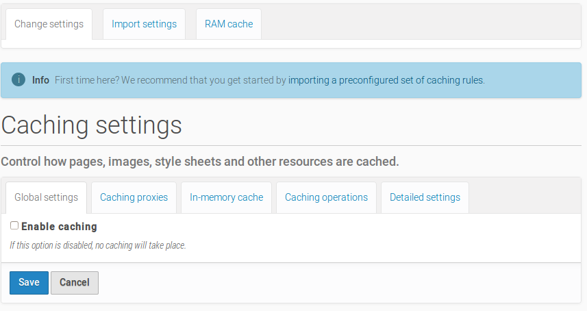

Caching
=======

.. robot screenshot not working for unknown reason, robot user has no access to cache although logged in as Manager
.. replacing with static screenshot for now

.. .. include:: ../../_robot.rst

.. .. code:: robotframework
..    :class: hidden

..   *** Test Cases ***

..   Show caching setup screen
       Go to  ${PLONE_URL}/@@caching-controlpanel
       Capture and crop page screenshot
       ...  ${CURDIR}/../../_robot/caching-setup.png
       ...  css=#content

**Caching** is the process where information is kept in a temporary store, to deliver to the visitor more quickly.

It is always a balancing act between the 'freshness' of the content, and speed.

Enabling caching here withing Plone is highly recommended, but fine-tuning it can be more of an art than a science.

Plone comes with a fairly conservative, but highly effective set of defaults. Importing those settings is your best course of action in almost all cases.

Plone's internal caching works even better when used together with an external cache, such as Varnish.

See the :doc:`Guide to caching </manage/deploying/caching/index>` for more information.

