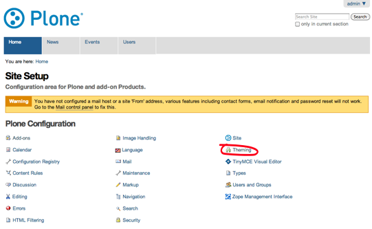
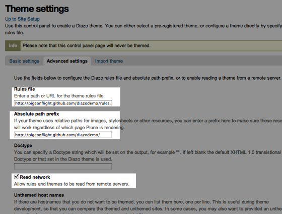
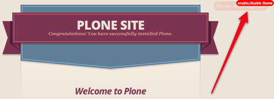
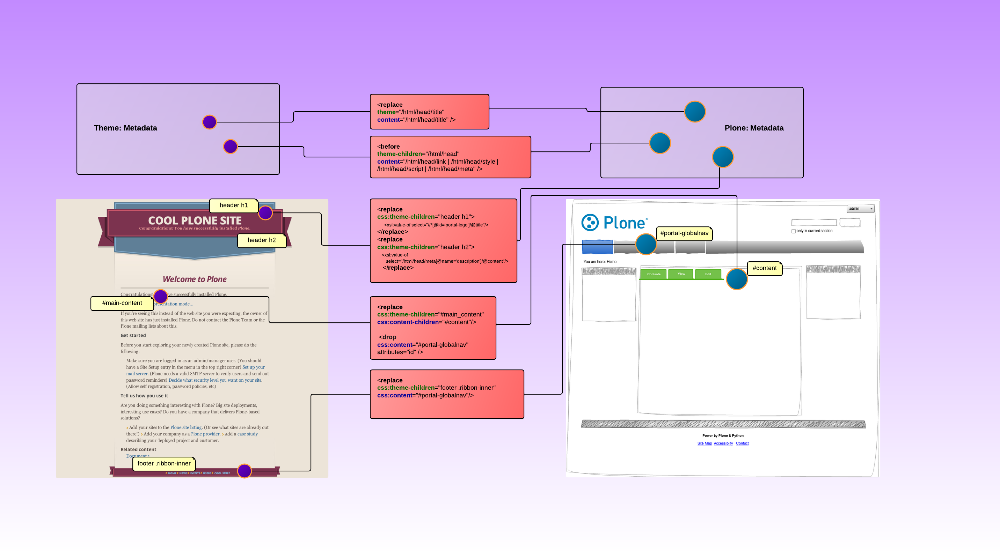

=================
Quick Test Recipe
=================

.. admonition:: Description

    Diazo is the system used to implement Plone themes.
    As of Plone 4.2, Plone ships with all the 'machinery'
    required to get started with Diazo based theme creation.
    This recipe is designed to get you started quickly.

    The goal of this recipe is to help you confirm that everything is working. The theme resources for this recipe are hosted on a github page (http://pigeonflight.github.io).

Ingredients
============

You will need to have the following:

* Administrative access to a working copy of Plone 4.2 or (Plone 4.1 with plone.app.theming installed)

Procedure
===========

If you're using Plone 4.2, look for 'Site Setup' > 'Theming'.

In a Plone 4.1 with plone.app.theming you may find the same thing under 'Site Setup' > 'Diazo theme'
Instead.

.. image:: images/sitesetup-cp.png

.. note:: If you don't see anything like the 'Diazo theme' option, go to 'Site Setup' > 'Add-ons', select 'Diazo theme support' and click 'Activate'.

In the Diazo theming control panel click on the 'Advanced Settings' tab.

Enter the following values:

 **Rules file:** http://pigeonflight.github.io/diazodemo/rules.xml

 **Absolute path prefix:** http://pigeonflight.github.io/diazodemo/

 **Read network** should be checked, then click 'save'

.. important:: Make sure that your Diazo theme is enabled

.. note:: The rule file and resources in this example are hosted online, this will be a problem if your Plone site is behind a firewall or otherwise not connected to the internet.

When you visit your Plone site you will see a the main content displayed inside of the custom theme provided by http://pigeonflight.github.io/diazodemo.

It should look similar to this screenshot:

 .. image:: images/plone_theme_dev_theming-test-screenshot.png

Disabling the test theme
------------------------------

To disable the test theme click on the enable/disable button at the top right.
Then uncheck the 'Theme enabled' box.

How the rule.xml file works
------------------------------

Think of the rules.xml file as a mapper which uses CSS ids and classes
to identify content from the Plone site that should be injected into
an HTML document.

The diagram below explains this visually.

:download:`View an explanatory diagram in PDF format <diazothemeexplained.pdf>`

Troubleshooting
------------------

The theme is not showing

	Check 'Site Setup' > 'Diazo Theme' and ensure that under 'Basic Settings', 'Enabled' is checked.
