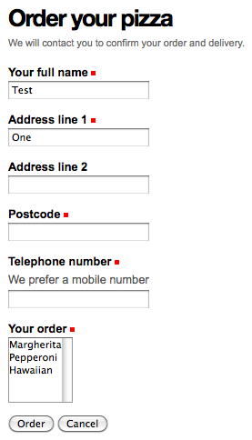

Testing the form 
=====================

**Seeing the form in action**

The schema and (grokked) form view is all that’s needed to create the
first iteration of the form. We can now install our new package and test
the form.

First, we make sure that we have run *bin/buildout* so that the new
package is available to the Zope instance script. We then start up Zope
in foreground mode:

::

    bin/instance fg

Next, we create or go to a Plone site, and install the new *Example
forms* product via the new Plone site creation form or the Add-ons
control panel. This should also install the product called *Plone
z3c.form support* (from the *plone.app.z3cform* package) as a
dependency.

We haven’t created any links to the form yet (though you could easily do
so in a content item or portlet by inserting a manually-entered URL),
but the form can be visited by going to the *@@order-pizza* view on the
Plone site root, e.g.:

    *http://localhost:8080/Plone/@@order-pizza*

It should look something like this:

Try to fill in the form and use the two buttons. You should see the
validation (both on-the-fly and after submit if you ignore the
on-the-fly warnings), as well a message printed to the console if a
valid form is submitted when clicking the *Order* button.
