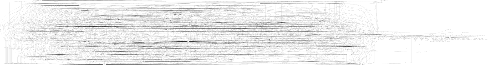

## Dependency Visualization

Here is the Python dependency graph for Plone:

## Dependency Visualization

Here is a diagram showing the Python dependencies of Plone generated using `pipdeptree` and `pipforester`:

This diagram helps visualize how the Python packages in Plone relate to each other.  
Cyclic dependencies are automatically detected and handled.  
Packages like `zope.*`, `zc.*`, and `setuptools` were excluded to focus on the core Plone dependencies.

