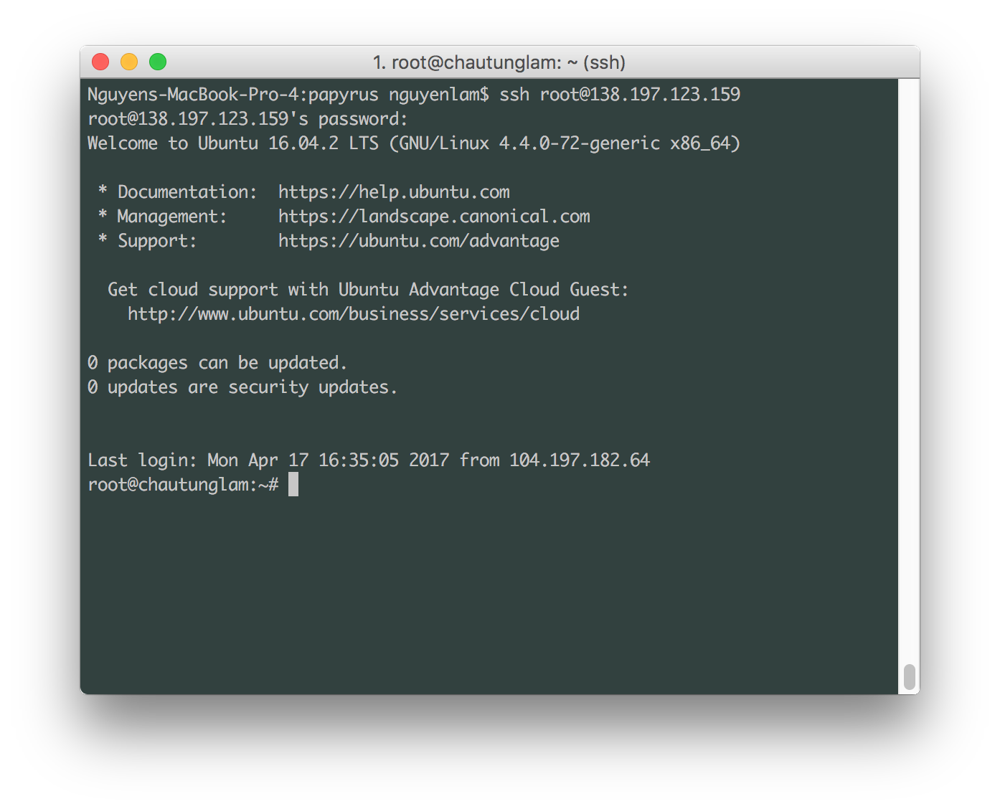

=============================
Deploy your Plone app to Heroku and Digital Ocean
=============================

.. admonition:: Description

    Since deploying a Plone site might be a challenge for new Plone users, this tutorial aims for solving those difficulties.


Introduction
------------

There are a lot of ways to deploy a Plone site. However, many people would want to deploy their Plone sites for testing and developing Plone before they can find services that fit their needs.
Therefore, this tutorial will show how to deploy Plone on Heroku and Digital Ocean, which are the popular platforms for development.


Deploying your Plone site on Heroku
------------

Heroku is very useful in deploying testing sites since it is free and flexible. It supports many programming languages and necessary add-ons for different development environments.
Deploying apps on Heroku is one of the way to show people your work samples without spending money.
Plone has a `Heroku buildpack <https://plone.org/download>`_ that supports deploying automatically.
However, this tutorial will show step-by-step deploying Plone app on Heroku manually for better understanding.

Setting up Heroku account and local environment
^^^^^^^^^

First of all, to deploy an app on Heroku, you will need an account. Head to `Heroku home page <https://www.heroku.com/>`_ to sign up for a free account and get started.

.. image:: ../images/herokuapp.png
    :align: center
    :alt: Create Droplet

You then need to install Heroku Toolbelt, which is a tool that helps deploying apps from your local machine to Heroku.
You can find an installer that suits your computer with full instruction at `Heroku documentation <https://devcenter.heroku.com/articles/heroku-cli>`_.

Download and deploy Plone
^^^^^^^^^

In this tutorial, we are going to use the training-sandbox Plone package, because it is designed for Heroku deployment.
Clone the Plone training-sandbox.

.. code-block:: shell

    git clone https://github.com/collective/training-sandbox
    cd training-sandbox

You will then need to create a Heroku app.

.. code-block:: shell

    heroku create --buildpack https://github.com/plone/heroku-buildpack-plone [your-app-name]

    git remote -v
      heroku	https://git.heroku.com/[your-app-name].git (fetch)
      heroku	https://git.heroku.com/[your-app-name].git (push)

Since we need database service for our Plone app, we need to have a database add-on for our app. 
We will use Heroku Postgre. More information about it can be found `here <https://www.heroku.com/postgres>`_.

.. code-block:: shell

    heroku addons:create heroku-postgresql:hobby-dev --app [your-app-name]

Now we should be good to go for deploying our app to Heroku

.. code-block:: shell

    git add .
    git commit -m "your commit message"
    git push heroku master


Deploying your Plone app to Digital Ocean
------------

Setting up accounts and droplets
^^^^^^^^^

This is based on the tutorial `here <https://www.digitalocean.com/community/tutorials/how-to-create-your-first-digitalocean-droplet-virtual-server>`_. But it is shorten to make the process more convenient.

First of all, you will need to set up your Digital Ocean account at `Digital Ocean <https://www.digitalocean.com/>`_. Fill in your email and email password to sign up.

After having your account ready, you will need to create a droplet.
A droplet is the way Digital Ocean calls its own Virtual Private Server (VPS). 
Click on the Create Droplet button on the right corner of the screen.

.. image:: ../images/create_droplet.png
    :align: center
    :alt: Create Droplet

You will be redicrect to the droplet selection page. 
In here, you will select the OS for your Droplet. In this tutorial, we will select the Ubuntu 16.04 OS for our VPS.

.. image:: ../images/create_dropletos.png
    :align: center
    :alt: Create Droplet

After that, you will need to select the plan for your Droplet. Usually, we will choose the $10/month since it provides good space for cahing.
In addition, this plan also prevents some errors that we might get into while deploying our Plone sites.

.. image:: ../images/create_dropletsize.png
    :align: center
    :alt: Create Droplet


Sign in to your Droplet 
^^^^^^^^^

Mac and Linux
`````````

If you are using Mac, you will have to turn on the terminal and type in:

.. code-block:: shell

    ssh root@[your-droplet-ip-adress]

It will ask you to fill in your password. When you created a droplet, an email should be sent to you. 
It contains the password for your droplet. Use this password to log in to your droplet through the terminal. 
When finished, the system will ask you to reset the password (since it is just the temporary one). 
You will have to type the password you got in again, then type the password you want to set for the system.



When you are done with it, make sure that you are in the /root directory. Install the Unified Installer 

.. code-block:: shell

    wget --no-check-certificate https://launchpad.net/plone/5.0/5.0.7/+download/Plone-5.0.7-UnifiedInstaller.tgz

Run the Unified Installer and follow the instruction in the Ubuntu Production.

Windows
`````````

On Windows, you will have to download `Putty <http://www.chiark.greenend.org.uk/~sgtatham/putty/latest.html>`_.
Run the setup. When you are done, start Putty.
Fill in your droplet-ip-address, port 22 and Enter. It should open a linux terminal for you to fill in your username and password.

.. image:: ../images/winputty.png
    :align: center
    :alt: Create Droplet

When you are done, it shold ask you to change the password since the password you received in email is just a temporary one.

.. image:: ../images/winputtyshell.png
    :align: center
    :alt: Create Droplet

When you are in, make sure that you are at the root directory and download the Unified Installer

.. code-block:: shell

    wget --no-check-certificate https://launchpad.net/plone/5.0/5.0.7/+download/Plone-5.0.7-UnifiedInstaller.tgz

Run the Unified Installer and follow the instruction here


Errors
^^^^^^^^^

Cannot install lxml==3.5.0
`````````

.. code-block:: shell

    Getting distribution for 'lxml==3.5.0'.
    x86_64-linux-gnu-gcc: internal compiler error: Killed (program cc1)
    Please submit a full bug report,
    with preprocessed source if appropriate.
    See <file:///usr/share/doc/gcc-5/README.Bugs> for instructions.
    /tmp/easy_install-2kIfB2/lxml-3.5.0/temp/xmlXPathInitjW78Bn.c:2:1: warning: return type defaults to ‘int’ [-Wimplicit-int]
     main (int argc, char **argv) {
     ^
    Building lxml version 3.5.0.
    Building without Cython.
    Using build configuration of libxslt 1.1.28
    Compile failed: command 'x86_64-linux-gnu-gcc' failed with exit status 4
    error: Setup script exited with error: command 'x86_64-linux-gnu-gcc' failed with exit status 4
    An error occurred when trying to install lxml 3.5.0. Look above this message for any errors that were output by easy_install.
    While:
      Installing instance.
      Getting distribution for 'lxml==3.5.0'.
    Error: Couldn't install: lxml 3.5.0

This error will show up when you use the Unified Installer with the $5/month plan on Digital Ocean. 
You will need to have the $10/month in order to run the Unified Installer.

The Installer does not generate all the Plone files
`````````

This error happens when the path specified while running the Unified Installer is fixed. 
Fix: run the Unified Installer again. But you need to leave the installation path as default. 
