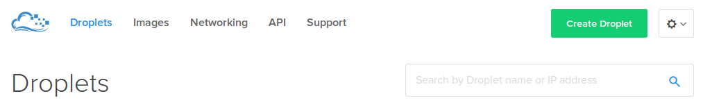
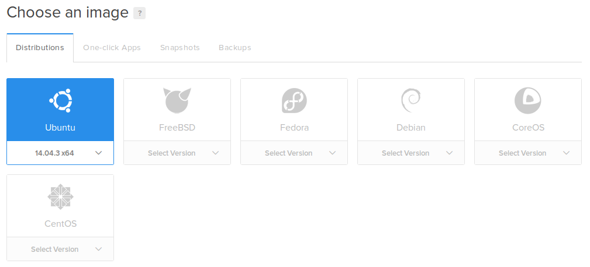
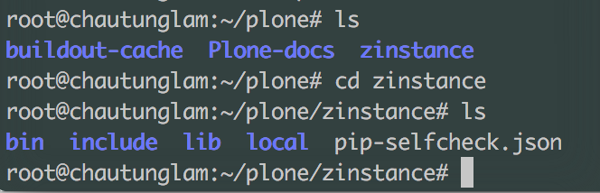

=============================
Deploy your Plone app to Heroku and Digital Ocean
=============================

.. admonition:: Description

    Since deploying a Plone site might be a challenge for new Plone users, this tutorial aims for solving those difficulties.


Introduction
------------

There are many ways to deploy a Plone site. 
However, we sometimes would want to deploy our Plone sites for testing and developing Plone before we can find services that fit our needs.
Therefore, this tutorial will show how to deploy Plone on Heroku and Digital Ocean, which are the popular platforms for development.


Deploying your Plone site on Heroku
------------

Heroku is very useful in deploying testing sites since it is free and flexible. 
It supports many programming languages and necessary addons for different development environments.
Deploying apps on Heroku is one of the way to show people our work samples without spending money.
Plone has a `Heroku buildpack <https://plone.org/download>`_ that supports deploying automatically.
On the other hand, this tutorial will show step-by-step deploying Plone app on Heroku manually for better understanding.

Setting up Heroku account and local environment
^^^^^^^^^

First of all, to deploy an app on Heroku, we will need an account. 
Head to `Heroku home page <https://www.heroku.com/>`_ to sign up for a free account and get started.


We then need to install Heroku Toolbelt, which is a tool that helps deploying apps from our local machine to Heroku.
You can find an installer that suits your computer with full instruction at `Heroku documentation <https://devcenter.heroku.com/articles/heroku-cli>`_.

Download and deploy Plone
^^^^^^^^^

We are going to use the training-sandbox Plone package because it is designed for Heroku deployment.
Firstly, we will clone the Plone training-sandbox.

.. code-block:: shell

    git clone https://github.com/collective/training-sandbox
    $ cd training-sandbox

We then need to create a Heroku app.

.. code-block:: shell

    heroku create --buildpack https://github.com/plone/heroku-buildpack-plone [your-app-name]
    $ git remote -v
        heroku	https://git.heroku.com/[your-app-name].git (fetch)
        heroku	https://git.heroku.com/[your-app-name].git (push)

Since we need database service for our Plone app, we need to have a database addon. 
We will use Heroku Postgre. More information about it can be found `here <https://www.heroku.com/postgres>`_.

.. code-block:: shell

    heroku addons:create heroku-postgresql:hobby-dev --app [your-app-name]

Now we should be good to go for deploying our app to Heroku

.. code-block:: shell

    git add .
    $ git commit -m "your commit message"
    $ git push heroku master


Deploying your Plone app to Digital Ocean
------------

Digital Ocean is a service that provides VPS and root access for users, 
which makes it very convenient since there are services that do not give full control over the VPS.
We will use this platform for our tutorial since Digital Ocean is cheap and reliable.


Setting up accounts and droplets
^^^^^^^^^

First of all, we will need to set up your Digital Ocean account at `Digital Ocean <https://www.digitalocean.com/>`_. 
Use our email and email password to sign up.

After having your account ready, we will need to create a droplet.
A droplet is the way Digital Ocean calls its own Virtual Private Server (VPS). 
Click on the Create Droplet button on the right corner of the screen.



We will be redicrect to the droplet selection page. 
In here, we need to check the OS for your Droplet. In this tutorial, we choose the Ubuntu 16.04 OS for our VPS.



After that, we need to choose the plan for your Droplet. 
Usually, we will use the $10/month since it provides good space for caching.
In addition, this plan also prevents some errors that we might get into while deploying our Plone sites.

.. image:: ../images/create_dropletsize.png
    :align: center
    :alt: Choose droplet size

.. note::
    In case you want to deploy your app on a specific domain name, you can learn how to set it up at `Digital Ocean documentation <https://www.digitalocean.com/community/tutorials/how-to-set-up-a-host-name-with-digitalocean>`_


Sign in to your Droplet 
^^^^^^^^^

Mac and Linux
`````````

If you are using Mac or Linux environment, you will have to turn on the terminal and type in:

.. code-block:: shell

    ssh root@[your-droplet-ip-adress]

It will ask you to fill in your password. When you created a droplet, an email should be sent to you. 
It contains the password for your droplet. Use this password to log in to your droplet through the terminal and change your password.

When you are done with it, make sure that you are in the /root directory. Install the Unified Installer 

.. code-block:: shell

    wget --no-check-certificate https://launchpad.net/plone/5.0/5.0.7/+download/Plone-5.0.7-UnifiedInstaller.tgz


Windows
`````````

On Windows, you will have to download `Putty <http://www.chiark.greenend.org.uk/~sgtatham/putty/latest.html>`_.
Run the setup. When you are done, start Putty.
Use your droplet ip address, port 22 and hit enter. It should open a linux terminal for you to fill in your username and password.
Log in to your droplet with the password from the email that you received.

.. image:: ../images/winputty.png
    :align: center
    :alt: Windows putty setup

When you are done, it shold ask you to change the password.


Deploy Plone to VPS
^^^^^^^^^

When you are in, make sure that you are at the root directory and download the Unified Installer

.. code-block:: shell

    wget --no-check-certificate https://launchpad.net/plone/5.0/5.0.7/+download/Plone-5.0.7-UnifiedInstaller.tgz
    $ tar -xf Plone-5.0.7-UnifiedInstaller.tgz

Run the the Unified Installer

.. code-block:: shell

    cd Plone-5.0.7-UnifiedInstaller
    $ ./install.sh $OPTION

.. note::
    For deployment on Digital Ocean, you should run the Installer with default installation path, which is /opt/plone

After the installer has successfully installed Plone on our VPS, we will run the buildout and test the server.

.. code-block:: shell

    cd /opt/plone/zinstance
    $ sudo -u plone_buildout bin/buildout
    $ ./bin/instance fg

We now can see that our Plone app is running at [your-droplet-id]:8080.
For more information on how to make the app run along with the server, follow from step 3 :doc:`Ubuntu Production deployment </manage/deploying/production/ubuntu_production>`.

.. note::
    You will have to replace the path specified in step 3 with your Plone app path. In this case, it should be /opt/plone/zinstance

When you finish step 5, you should have your Plone app running at [your-host-name].com.

Common errors
^^^^^^^^^

Cannot install lxml==3.5.0
`````````

.. code-block:: shell

    Getting distribution for 'lxml==3.5.0'.
    x86_64-linux-gnu-gcc: internal compiler error: Killed (program cc1)
    Please submit a full bug report,
    with preprocessed source if appropriate.
    See <file:///usr/share/doc/gcc-5/README.Bugs> for instructions.
    /tmp/easy_install-2kIfB2/lxml-3.5.0/temp/xmlXPathInitjW78Bn.c:2:1: warning: return type defaults to ‘int’ [-Wimplicit-int]
     main (int argc, char **argv) {
     ^
    Building lxml version 3.5.0.
    Building without Cython.
    Using build configuration of libxslt 1.1.28
    Compile failed: command 'x86_64-linux-gnu-gcc' failed with exit status 4
    error: Setup script exited with error: command 'x86_64-linux-gnu-gcc' failed with exit status 4
    An error occurred when trying to install lxml 3.5.0. Look above this message for any errors that were output by easy_install.
    While:
      Installing instance.
      Getting distribution for 'lxml==3.5.0'.
    Error: Couldn't install: lxml 3.5.0

This error will show up when you use the Unified Installer on the $5/month plan droplet. 
You will need to have the $10/month in order to run the Unified Installer. 
After finishing the setup, you can resize the droplet to 5$/month plan if you want.

The Installer does not generate all the Plone files
`````````


This error happens when the default installation path in Unified Installer has been modified.
**How to fix**: run the Unified Installer again. But you need to leave the installation path as default. 
