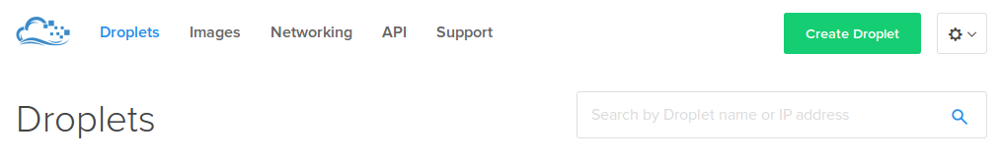

=============================
VPS services to deploy Plone sites
=============================

.. admonition:: Description

    A step-by-step guide to installing Plone on a VPS, particularly Digital Ocean

Introduction
------------

This tutorial will show you how to deploy your sites on a VPS. Digital Ocean is one of the service that we will be using in this topic.

Setting up accounts and droplets
------------

This is based on the tutorial `here <https://www.digitalocean.com/community/tutorials/how-to-create-your-first-digitalocean-droplet-virtual-server>`_. But it is shorten to make the process more convenient.

First of all, you will need to set up your Digital Ocean account at `Digital Ocean <https://www.digitalocean.com/>`_. Fill in your email and email password to sign up.

After having your account ready, you will need to create a droplet.
A droplet is the way Digital Ocean calls its own Virtual Private Server (VPS). 

.. image:: ../images/create_dropletos.png
    :align: center
    :alt: Create Droplet

.. image:: ../images/create_dropletsize.png
    :align: center
    :alt: Create Droplet

Sign in to your Droplet 
------------
Mac and Linux
^^^^^^^^^

If you are using Mac, you will have to turn on the terminal and type in:

.. code-block:: shell

	ssh root@[your-droplet-ip-adress]

It will ask you to fill in your password. When you created a droplet, an email should be sent to you. 
It contains the password for your droplet. Use this password to log in to your droplet through the terminal. 
When finished, the system will ask you to reset the password (since it is just the temporary one). 
You will have to type the password you got in again, then type the password you want to set for the system.
When you are done with it, make sure that you are in the /root directory. Install the Unified Installer 

.. code-block:: shell

	wget --no-check-certificate https://launchpad.net/plone/5.0/5.0.7/+download/Plone-5.0.7-UnifiedInstaller.tgz

Run the Unified Installer and follow the instruction in the Ubuntu Production.

Windows
^^^^^^^^^

On Windows, you will have to download `Putty <http://www.chiark.greenend.org.uk/~sgtatham/putty/latest.html>`_.
Run the setup. When you are done, start Putty.
Fill in your droplet-ip-address, port 22 and Enter. It should open a linux terminal for you to fill in your username and password.
When you are done, it shold ask you to change the password since the password you received in email is just a temporary one.
When you are in, make sure that you are at the root directory and download the Unified Installer

.. code-block:: shell

	wget --no-check-certificate https://launchpad.net/plone/5.0/5.0.7/+download/Plone-5.0.7-UnifiedInstaller.tgz

Run the Unified Installer and follow the instruction here

Errors
------------

