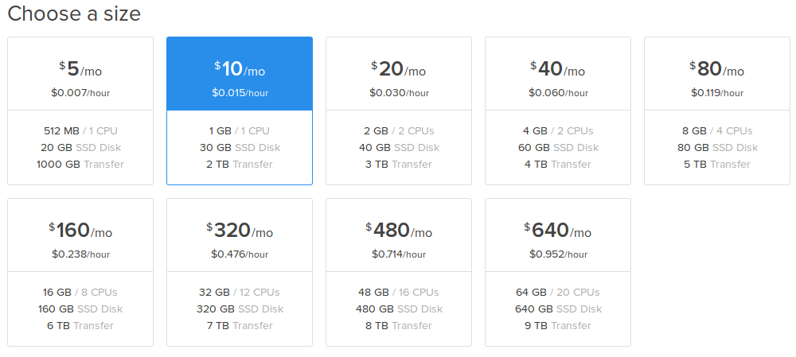

=============================
VPS services to deploy Plone sites
=============================

.. admonition:: Description

    A step-by-step guide to installing Plone on a VPS, particularly Digital Ocean

Introduction
------------

This tutorial will show you how to deploy your sites on a VPS. Digital Ocean is one of the service that we will be using in this topic.

Setting up accounts and droplets
------------

This is based on the tutorial at https://www.digitalocean.com/community/tutorials/how-to-create-your-first-digitalocean-droplet-virtual-server. But it is shorten to make the process more convenient.

First of all, you will need to set up your Digital Ocean account at https://www.digitalocean.com/. Fill in your email and email password to sign up.

After having your account ready, you will need to create a droplet.
A droplet is the way Digital Ocean calls its own Virtual Private Server (VPS). 

.. image:: ../images/create_droplet.png
    :align: center
    :alt: Create Droplet

.. image:: ../images/create_dropletos.png
    :align: center
    :alt: Create Droplet

Sign in to your Droplet 
------------
Mac:

If you are using Mac, you will have to turn on the terminal and type in:

