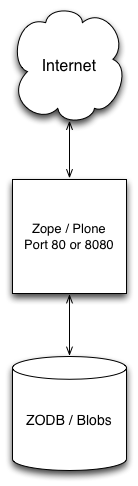
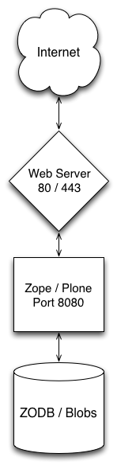
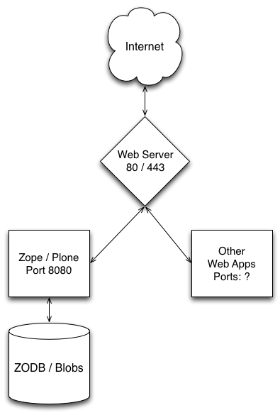

Background: the stack
=====================

Many integrators arrive at Plone after previously working with PHP applications.
They are used to using Apache with modPHP and an SQL server.
This common application-server software stack is often deployed from the start on a pre-configured server, and installation of a PHP application may require little more than unpacking a set of files to a particular point in
the file system.

The Plone application is a different animal.
It runs on its own application server (Zope), and in common installations uses the Zope Object Database (ZODB) rather than an SQL database.
It is nearly always deployed in conjunction with other tools, like web servers (e.g., Apache or Nginx), load balancers (like haproxy), and reverse-proxy caches (like varnish or squid).
This is what we’ll be discussing in this guide.

It is actually possible to deploy Plone/Zope as a stand-alone web server.
If you do a simple “standalone” installation of Plone, you will end up with a working web server answering requests on port 8080 (which may be changed).

While there are production servers doing just this (typically changing the listening port from 8080 to 80), it’s uncommon.
It’s much more common to put a general-purpose web server like Apache or Nginx between Plone and the Internet:

In this stack, it’s the general-purpose web server that is connected to well-known Internet ports.
Apache or Nginx answers those request and forwards them to Plone. It does so by proxying the requests.

If Plone/Zope has a built-in web server, why do you need another?

* The bare Zope server is fine for development, but does not have the strong security and forensic mechanisms of HTTP servers like Nginx or Apache. **Zope/Plone is not meant to be exposed to the Internet without a guarding reverse-proxy server.**

* You may wish to use Zope and Plone as part of a hybrid system with other best of breed components providing parts of your web site.
  For example, Plone is not really meant for the kind of database applications that require a relational solution.
  A good, general-purpose web server like Apache or Nginx serves as a great mechanism for dispatching different requests to different, best-of-breed components.
  They’re also great for quickly serving static resources.

* Even in the simplest installation, it’s desirable to do some URL rewriting to map URLs to data in different ways.
  This is nearly mandatory when building a hybrid system.

* Plone does not have built-in SSL support. A general-purpose web server will have a hardened SSL layer and a mechanism for handling certificates.

* You may wish to solve authentication and logging problems at a shared, higher level.

    Zope + Web Server + Web Apps

Load balancing
--------------

The deployment above may meet your needs for light-traffic sites.
Its principle limitation is that it will make use of only a single processor and file system to render Plone pages.

The Zope application server allows us to divide the chores of rendering web pages (very CPU-intensive) from those of maintaining the file-system database.
Further, we may have as many page rendering clients as we wish, all using a single database server.

The components of this mechanism, Zope Enterprise Objects (ZEO), are ZEO clients and ZEO servers.

How ZEO Works

    A metaphor of a restaurant helps to explain the way ZEO works.

    In this metaphor, you can think of Plone as a chef who needs to cook meals to serve them to customers (the meals are web pages, and the customers are visitors to your website). The cook needs to get ingredients to make a meal, and those ingredients (page contents, menu listings, etc) are in a refrigerator (our database). If Plone is running without ZEO, then every time a new meal needs to be made, the chef has to go to the refrigerator to get ingredients. This takes time, and means that only one meal can be cooked at a time.

    Now, imagine if there were a chef’s assistant who can run and get the ingredients for the chef. The cool part is that when you have a chef’s assistant, you can have lots of chefs all cooking meals, and the assistant can make it more efficient to get each of them the ingredients they need. More chefs cooking more meals means that more customers can get served in the same amount of time, and the process of getting ingredients for them is more efficient.

    The ZEO server is that chef’s assistant in our metaphor. It allows us to run multiple instances of Plone in front of a single database, and makes it possible to serve many many more pages to more customers in the same amount of time.

ZEO Clients
    Web servers in themselves, which answer requests for pages, gather page component objects from the database server, render pages and return them to the requestor.

ZEO Server
    Handles read/write requests for the object database from ZEO Clients. Not HTTP servers, and not meant to be visible to the Internet.

.. figure:: images/zeo_cluster.png
    :align: center
    :alt: ZEO Cluster

    ZEO Cluster

It is typical in a high-demand server situation to deploy as many ZEO clients as you have CPU cores available.
More is not useful (except for a spare, debug client).
ZEO clients are generally CPU/RAM-intensive. The ZEO server is a heavy disk-system user.

For multiple ZEO clients to be actually useful, you need a load-balancing front-end to distribute requests among the clients.
The load balancer receives http requests and proxies them among a pool of ZEO clients.

.. figure:: images/zeo_cluster_load_balanced.png
    :align: center
    :alt: ZEO Cluster with Load Balancer

    ZEO Cluster with Load Balancer

Apache and Nginx have built-in load-management capabilities, which can allow you to combine those two layers of the stack.
A dedicated load balancer like `haproxy <http://haproxy.1wt.eu/>`_ offers better features for distributing load among clients and for checking and maintaining status.

How many ZEO clients, how much memory?
~~~~~~~~~~~~~~~~~~~~~~~~~~~~~~~~~~~~~~

It's typical to allocate roughly one ZEO client for every processor core you have available.
However, there are lots of trade-offs, and many clients will eat RAM rapidly. :doc:`About Instances, Threads and RAM consumption </manage/deploying/performance/instancesthreads>` is a good guide to the issues involved.

Sticky sessions
~~~~~~~~~~~~~~~

As a rule of thumb, you'll tend to get better performance if you can direct requests from the same browser client to the same Zope instance (ZEO client).
That's because the memory cache of the ZEO-client is more likely to be loaded with information useful for rendering requests from that source.
The effect can be particularly strong for logged-in users.

This is not a firm rule, though.
The more memory allocated to ZEO client caches, the smaller the effect.
Also, if a large portion of your traffic is from search engines, benefits will be negligible.
(In extreme cases, it may even be desirable to direct all your search engine traffic to the same ZEO client so that their atypical behavior doesn't spoil limited cache memory with infrequently requested pages.)

Most load balancers have some sort of mechanism for causing traffic from a single source to stick to a single ZEO client.
The simplest schemes use IP addresses; cookies may also be used.

Connections and queues
~~~~~~~~~~~~~~~~~~~~~~

A versatile load balancer like haproxy will give you fine-grained control over the queuing of connections to ZEO client back-end servers.
A factor to take into account is that ZEO clients will always accept connections - even when all threads are busy.
Given that requests take dramatically different amount of times to render and return, this may result in some clients having queued connections when other clients are free.

The general solution for this is to set the maximum connections per back-end ZEO client to roughly the number of threads they serve.
For haproxy, this is the maxconn setting for the listen directive.
This is only a rule of thumb.
ZEO clients actually spawn threads as needed to return blobs, and are very efficient at that.

How severely you limit connections per client should depend on your balance of page to blob serves.

Server-side HTTP caching
------------------------

When a web browser requests and receives a web resource, it silently saves the page or graphic in a local disk cache in case it may be needed later.
This saves the expense of downloading the resource again.

A server-side HTTP cache does much the same thing. After Plone renders a resource, which may be a very expensive process, it saves the rendered resource in case it should be requested again soon.

With a caching reverse proxy in place, our delivery stack looks like:

.. figure:: images/zeo_cluster_cached.png
    :align: center
    :alt: ZEO Cluster with Server-Side Caching

    ZEO Cluster with Server-Side Caching

As with load balancing, Apache and Nginx have built-in proxy caching abilities.
If those are inadequate, Varnish or Squid are often used.

Nothing is simple about caching.
There is always a trade off between currency of delivered data and the performance of the cache layer.
Cache tuning for truly busy sites requires extensive measurement and experimentation, often with business decisions about the expense of currency loss vs enhanced servers.

Caching setup in Plone
~~~~~~~~~~~~~~~~~~~~~~

In their basic outlines, browser and server-side caching work the same way.
The browser or the server caches resources against the possibility that they may be needed again soon.
But, how does the caching agent make the decision about how long to store a resource? Or, if it should be stored at all?

Generally, these decisions are made on the basis of caching hints that are in the HTTP response headers.
The web server, or Plone, may indicate that a resource should not be cached at all, that it may be safely cached for a certain period of time, or that the caching agent should revalidate the resource by asking the server if it's changed.

Out of the box, Plone is very conservative. It assumes that currency is critical, and only tells the caching agent to store resources like icons.
You may tune this up considerably by installing the *HTTP Caching* add on via the Plone control panel, then using the * caching* configlet to set cache rules.

The *HTTP Caching* add on is shipped with Plone, but not activated.
You don't need to add it to your buildout packages.
Just activate it and go.
By the way, the package that does the work is ``plone.app.caching``, and that's how it's often discussed.

Caching settings
****************

**Import settings**

This is actually the place to start if you're new to cache settings.
Set a basic profile by making a choice from this menu. Then use ``Change settings`` to refine it to your needs.

**Global settings:**

Enable caching
    Turn this on, and you'll get some immediate improvement in cache efficacy -- including browser caches. Tune it up for your particular needs with the other panes in this configuration panel.

**Caching Proxies**

Think of this as the Varnish/Squid settings page, as it's mainly concerned with cache purging, which is typically not supported by web server proxy caches.

Cache purging is when an application server sends a message to a proxy cache to tell it that a resource needs refreshing.
Cache purging is generally desirable when you're using more aggressive caching rules.
If you are not setting rules to cache pages and other dynamic content, you don't need to worry about cache purging.

Caching dynamic resources like pages and trying to purge them on change is the dark, difficult side of caching.
It's safest for items like files and images; hardest for the kind of complex, composite pages that are Plone's specialty.

Turn purging off and avoid aggressive caching unless you're prepared to monitor, experiment and measure.

Purge settings are extremely dependent on your proxy cache setup.

**In-memory cache**

Here you are offered a simple tradeoff.
Memory for speed. Allocate more memory to the in-memory cache and pages are served faster.
Allocate less and they're rendered more frequently.
Just don't cache so much that your server starts using swap space for Zope processes.

**Caching operations / Detailed settings**

This is where you attach caching rules to resource types, and refine the caching rules.
In general, stick with one of the profile settings (from **Import settings**) unless you're prepared to immerse yourself in caching detail.
