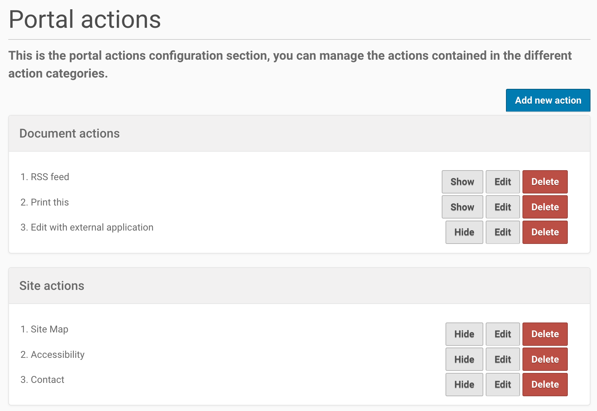
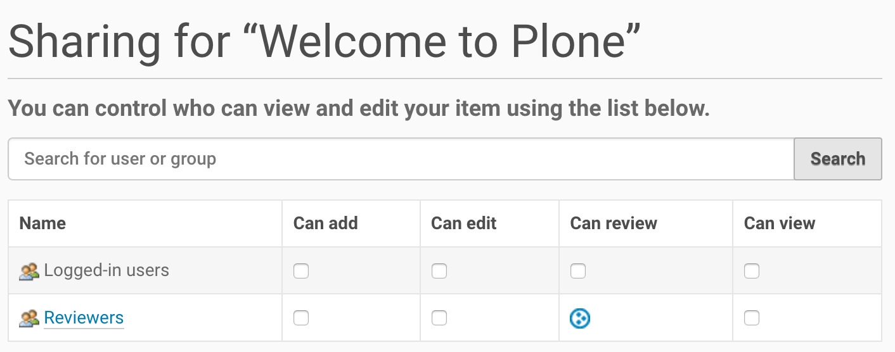

==========================
Upgrading Plone 5.0 to 5.1
==========================

.. admonition:: Description

   Instructions and tips for upgrading to Plone 5.1

.. note::

   If you want to upgrade add-ons to Plone 5.1, please see :doc:`/develop/addons/upgrade_to_51`

General Information
===================

- Before you upgrade read :doc:`../intro` and :doc:`../preparations`.
- Always upgrade from the latest version of 5.0.x to the latest version of 5.1.x.
  This will resolve many migration-specific issues.
- If you have problems don't be afraid to ask for help on https://community.plone.org

Upgrading
=========

To run the upgrade to 5.1 follow the links on top of the controlpanel or the ZMI to the form `/@@plone-upgrade`

Changes Between Plone 5.0 And 5.1
=================================

The following PLIPs (Plone Improvement Proposals) have been implemented for 5.1:

.. contents::
  :depth: 1
  :local:

Meta Bundles Generation
-----------------------

This is `PLIP 1277 <https://github.com/plone/Products.CMFPlone/issues/1277>`_.

For End Users
~~~~~~~~~~~~~

Pages will load faster because JavaScript and CSS resources are bundled.
An anonymous user will usually get one JavaScript file and one CSS file, instead of multiple.

For Developers
~~~~~~~~~~~~~~

To make use of this, you should register your resource bundle to merge with the ``default`` or ``loggedin`` bundle.

.. code-block:: python

  <records prefix="plone.bundles/my-addon"
            interface='Products.CMFPlone.interfaces.IBundleRegistry'>
    <value key="merge_with">default</value>
    ...
  </records>

See :ref:`Aggregate Bundles for Production <resource_bundle_aggregation>`.

Portal Actions Control Panel
----------------------------

This is `PLIP 1342 <https://github.com/plone/Products.CMFPlone/issues/1342>`_.

For End Users
~~~~~~~~~~~~~

A new control panel allows site administrators to manage the default portal actions.
These are for example site menus, user menus, footer links, etcetera.
It also allows to add custom ones.
Actions can be re-ordered, and can be hidden or displayed.

See :ref:`Creating actions through-the-web <create_actions_ttw>`.

For Developers
~~~~~~~~~~~~~~

Nothing changes.

Direct Link On Sharing Tab From Group Name Member List
------------------------------------------------------

This is `PLIP 1310 <https://github.com/plone/Products.CMFPlone/issues/1310>`_.

For End Users
~~~~~~~~~~~~~

When a Group is shown on the Sharing page, you can click on the group name to go to the list of members of that group.

For Developers
~~~~~~~~~~~~~~

Nothing changes.

OpenID Removed From Core
------------------------

This is `PLIP 1659 <https://github.com/plone/Products.CMFPlone/issues/1659>`_.

For End Users
~~~~~~~~~~~~~

Nothing changes.

For Developers
~~~~~~~~~~~~~~

The ``plone.app.openid`` package is no longer shipped with Plone.
This was rarely used.
Nowadays there are better and more flexible implementations for OpenID supporting many other protocols, like the more widespread OAuth2.
See for example `pas.plugins.authomatic <https://pypi.org/project/pas.plugins.authomatic/>`_.

``plone.app.openid`` is still available as an add-on package, but is no longer maintained by core developers.
If you want to use this in your site, you must add ``plone.app.openid`` to the buildout eggs.

portal_quickinstaller Deprecated
--------------------------------

This is `PLIP 1340 <https://github.com/plone/Products.CMFPlone/issues/1340>`_.

For End Users
~~~~~~~~~~~~~

Nothing changes.

For Developers
~~~~~~~~~~~~~~

The add-ons control panel in Plone 5.1 no longer supports installation or uninstallation code
in ``Extensions/install.py`` or  ``Extensions/Install.py``.
If you have such code, you must switch to a GenericSetup profile.
GenericSetup is already the preferred way of writing installation code since Plone 3.
If you must use the old way, you can still use the ``portal_quickinstaller`` in the Management Interface.

The ``portal_quickinstaller`` is scheduled to go away completely in Plone 6.

For more information on changes to profiles and the add-ons control panel, see the add-on :ref:`Installation code <addon_installation_code>` upgrade docs.

Conditionally Import Configuration Registry Records
---------------------------------------------------

This is `PLIP 1406 <https://github.com/plone/Products.CMFPlone/issues/1406>`_.

For End Users
~~~~~~~~~~~~~

Nothing changes.

For Developers
~~~~~~~~~~~~~~

Importable records in ``registry.xml`` can be marked as conditional with the ``condition`` attribute, which supports the following condition values:

* ``installed my.package``, which causes record to be imported only when python module ``my.package`` is available to be imported.

* ``not-installed my.package``, which causes record to be imported only when python module ``my.package`` is *not* available to be imported.

* ``have my-feature``, which causes record to be imported only when ZCML feature flag ``my-feature`` has been registered (Zope2 only).

* ``not-have my-feature``, which causes record to be imported only when ZCML feature flag ``my-feature`` has *not* been registered (Zope2 only).

For example, the following ``registry.xml`` step in the GenericSetup profile of your policy product, would only import records when module ``my.package`` is available:

.. code-block:: xml

  <registry>
    <records interface="my.package.interfaces.IZooSettings"
             condition="installed my.package">
      <value key="entryPrice">40</value>
      <value key="messageOfTheDay">We've got lions and tigers!</value>
    </records>
  </registry>

.. note::

  This feature is actually already available since Plone 5.0.7.

For the ``have`` and ``not-have`` conditions, the following features are defined in Plone for seeing which Plone version is used:

- ``plone-4``
- ``plone-41``
- ``plone-42``
- ``plone-43``
- ``plone-5``
- ``plone-51``
- ``plone-52``

.. note::

  These feature definitions have been defined since Plone 4.1.
  A Plone version will define all previous features as well.
  If ``have plone-43`` is true, this means you are on Plone 4.3 or Plone 5 or higher.

More Configuration Registry Improvements
----------------------------------------

This is `PLIP 1484 <https://github.com/plone/Products.CMFPlone/issues/1484>`_.

For End Users
~~~~~~~~~~~~~

In the Configuration Registry control panel, you can import, export, add and delete records.

You can use the Configuration Registry control panel's Export tab to export the entire registry into a single XML file.
When you click the Export Now button, a file named ``registry.xml`` will be downloaded to your computer.

.. image:: https://raw.githubusercontent.com/plone/plone.app.registry/master/docs/configuration_registry_export_screenshot.jpg
   :alt: How to export the entire registry

To import registry entries, use the Configuration Registry control panel's Import tab, use the Choose File button to select an XML file from your computer containing the registry entries, then press the Import File button.

.. image:: https://raw.githubusercontent.com/plone/plone.app.registry/master/docs/configuration_registry_import_screenshot.jpg
   :alt: How to import a registry file

You can add individual registry records using the Configuration Registry control panel's "Add new record" tab.
Enter the registry record's name, (human readable) title, select a data type, and optionally check the Required box if the record must have a value.
Then press the "Add field" button.

.. image:: https://raw.githubusercontent.com/plone/plone.app.registry/master/docs/configuration_registry_add_record_screenshot.jpg
   :alt: How to add a registry record

For Developers
~~~~~~~~~~~~~~

Instead of storing registry entries in a single, large ``registry.xml`` file, you can have Generic Setup load and process registry entries from multiple files.
This makes it easier to manage and organize the registry entries provided by your applications and add-ons.

Your add-on should include a folder named ``registry`` in its profile folder, for example ``profiles/default/registry``.
Any XML files in that folder will be read and processed by the registry the same way it would have read and processed a single ``registry.xml`` file in the ``profiles/default`` folder.
The registry will process both the ``registry.xml`` file and the contents of a ``registry`` folder, if both exist.

Auto-Rotation For Images
------------------------

This is `PLIP 1673 <https://github.com/plone/Products.CMFPlone/issues/1673>`_.

For End Users
~~~~~~~~~~~~~

Photos can contain metadata (``exif`` data) about rotation.
When you upload an image, Plone now uses this metadata to show the image properly rotated.

Additionally, there is basic support for ``tiff`` images.
Previously, you could only upload them as simple files.
Now you can upload them as proper images, and they get scales (in the form of ``jpeg`` images).

For Developers
~~~~~~~~~~~~~~

The ``plone.namedfile`` package was partially restructured.
If you are using utility functions or internal methods from this package, you should check that your code still works.

The `piexif <http://piexif.readthedocs.io/en/latest/>`_ was added as dependency.

Faster Indexing
---------------

This is `PLIP 1343 <https://github.com/plone/Products.CMFPlone/issues/1343>`_.

For End Users
~~~~~~~~~~~~~

Adding or editing a document is faster, because care was taken to avoid duplicate indexing operations.

For Developers
~~~~~~~~~~~~~~

The `collective.indexing <https://pypi.python.org/pypi/collective.indexing>`_ package was merged into the core of Plone.
This makes sure that objects are only indexed once per transaction.

It also gives hooks for calling external indexers, like Solr and Elasticsearch.
See :ref:`Using external catalogs <using_external_catalogs>`.

There is a workaround when you get `Catalog Errors During Upgrades`_.

Use lxml Cleaner For Safehtml Transforms
----------------------------------------

This is `PLIP 1441 <https://github.com/plone/Products.CMFPlone/issues/1441>`_

For End Users
~~~~~~~~~~~~~

Nothing changes.

For Developers
~~~~~~~~~~~~~~

The transform for making html safe (like removing ``script`` tags) got a big cleanup.
Instead of the obsolete ``SGMLParser``, the ``lxml`` library is used.
This might give slightly different results.

Easily Change Default Search Order
----------------------------------

This is `PLIP 1600 <https://github.com/plone/Products.CMFPlone/issues/1600>`_.

For End Users
~~~~~~~~~~~~~

On the search page, results are by default sorted by relevance.
Visitors could already choose a different sort order each time.
New is that a site administrator can choose a different default.
In Site Setup, go to the Search Settings and set the *Sort on* field.
Options are: relevance, date (newest first) and alphabetically.

.. note::

  This feature was backported and is actually already available since Plone 4.3.12.
  It is not in Plone 5.0 though.

For Developers
~~~~~~~~~~~~~~

If you need to directly interact with this feature in code, you can use the ``Products.CMFPlone.interfaces.ISearchSchema.sort_on`` registry field.

HiDPI Image Scales
------------------

This is `PLIP 1483 <https://github.com/plone/Products.CMFPlone/issues/1483>`_.

For End Users
~~~~~~~~~~~~~

HiDPI stands for High Dots Per Image.
In the Image Handling Settings control panel in Site Setup, you can configure HiDPI mode for extra sharp images.
Monitors that support this, will show the extra sharp images, others will fall back to showing the standard image.

By default it is disabled.
You can enable it for showing double density (``2x``) or double and triple density (``2x, 3x``).
The monitor of the visitor will show the best available density.

Compare this low resolution image:

.. image:: /_static/plip_hidpi_low_resolution.png
    :align: center
    :alt: Example: low resolution

with this high resolution image:

.. image:: /_static/plip_hidpi_high_resolution.png
    :align: center
    :alt: Example: low resolution

.. note::
    These pictures are copyright Johannes Raggam.
    They show the "Which Hat Tower" in Minneapolis

For Developers
~~~~~~~~~~~~~~

When you enable this, it will result in image tags like this, for improved viewing on HiDPI screens:

.. code-block:: html

    

A fun way to check that this is effective, is by using two monitors connected to the same computer.
Empty the cache of your browser and open the network tab of your browser.
Load a page with an image on a standard monitor and you will see that a small image is downloaded.
Drag the page to the second, HiDPI-capable monitor, and you will see that a second, larger image is downloaded.

The Plone templates use this feature when available.
To benefit from this new feature in add-on code, you must use the ``tag`` method of image scales:

.. code-block:: html

    

If you are iterating over a list of image brains, you should
use the new ``@@image_scale`` view of the portal or the navigation root.

This will cache the result in memory, which avoids waking up the objects the next time.

.. code-block:: html

    <tal:block define="image_scale portal/@@image_scale">
        <tal:results tal:repeat="brain batch">
            
        </tal:results>
    </tal:block>

.. note::

    Images added in the TinyMCE editor do not currently benefit from this feature.

Cleanup And Enhance Icon And Thumb Aspects
------------------------------------------

This is `PLIP 1734 <https://github.com/plone/Products.CMFPlone/issues/1734>`_.

For End Users
~~~~~~~~~~~~~

The Site Control Panel now has more detailed options for handling icons and thumbnails.
You can switch off showing thumbs in portlets, list views, summary views or table views.
And if you show them, you can set a different scale for each.

.. image:: /_static/site-control-panel-icon-thumb-settings.png
    :align: center
    :alt: Site control panel with icon and thumb settings

For Developers
~~~~~~~~~~~~~~

For the current best way of showing icons for a custom content type, see :ref:`Content Type Icons <content-type-icons-changed>`.

If you want to allow editors to suppress showing thumbs or icons in individual folders, or to override the thumb size in listings, you should enable the ``plone.thumb_icon`` behavior.
This is the ``plone.app.contenttypes.behaviors.thumb_icon.IThumbIconHandling`` interface.
Your folderish content types should either use the templates from ``plone.app.contenttypes`` or look there for seeing how to properly handle icons and thumbs.

Rejected And Postponed PLIPs
----------------------------

For details about rejected or postponed PLIPs see the `github PLIP project <https://github.com/plone/Products.CMFPlone/projects/1>`_
and the `Framework Team PLIP status sheet <https://docs.google.com/spreadsheets/d/15Cut73TS5l_x8djkxNre5k8fd7haGC5OOSGigtL2drQ/>`_.

Known Issues
============

Catalog Errors During Upgrades
------------------------------

With the PLIP `assimilate collective.indexing <https://github.com/plone/Products.CMFPlone/issues/1343>`_ the operations for indexing, reindexing and unindexing are queued, optimized and only processed at the end of the transaction.

Only one indexing operation is done per object on any transaction.
Some tests and features might expect that objects are being indexed/reindexed/unindexed right away.

You can disable queuing altogether by setting the environment-variable `CATALOG_OPTIMIZATION_DISABLED` to `1`:

.. code-block:: console

    CATALOG_OPTIMIZATION_DISABLED=1 ./bin/instance start

It is a good idea to set `CATALOG_OPTIMIZATION_DISABLED=1` when upgrading if you get error messages related to the catalog.
