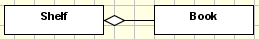
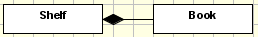
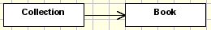

=========================================
Relationships between classes and objects
=========================================

.. contents :: :local:

.. admonition:: Description

        How to use references, associations, aggregations and compositions

With aggregations, compositions and associations you define where your new type will show up, what it might contain and to which content it can point to.

There is virtually no limit on how many aggregations, compositions and associations you can attach to a class.

Aggregations: Global Containment
--------------------------------

Aggregation means: This content can exist global and in this container. The container class that gets the empty rhomb (diamond) attached is derived from BaseFolder and it's ``allowed_content_types`` is set to the class that is attached to it. If more than class is attached to one class by aggregations the ``allowed_content_types`` is extended accordingly. The attached class keeps the default ``global_allow=1``.

Compositions: Strict Containment
--------------------------------

Compositions are used to model parts that exist or live and die with their associated owner. So the code generated is similar to the one generated by aggregations, but with one major difference: The attached classes are only allowed to be generated in the folderish type of the class they're attached to (this is done by setting ``global_allow=0`` in the factory type information of the class).

Directed Associations: References
---------------------------------

References are used to store the relation of an object to other objects.

Each content type that derives from ``IReferenceable`` is capable of being referenced. Objects from such a content type have an UID (Unique Identification) that's unique throughout the whole Plone site. Therefore References don't break if you move referenced objects around in the site.

To use ``ReferenceFields`` there are two possible ways. The by models-design clean way is to use directed associations. Another possibility is to define References as class-attributes.

Directed Associations
^^^^^^^^^^^^^^^^^^^^^
An directed association between two classes generates a ``ReferenceField`` in the class where the association starts.

The ``relationship`` itself is named after the association's name.

The multiplicity defines if the allows a 1:1 or 1:n relation.

.. attention::

    This only results in validation on the field. References at all don't know anything about
    multiplicity, so this is only a check on userinterface-level.

All other field settings are taken from the association's end, including information how to generate the widget. By default a ReferenceWidget is used. You can use tagged values on the association's end to define label, description, a different widget-type, schemata, etc. like you do it on a field (on a class attribute).

The big drawback of using associations to create ReferenceFields is that they always get attached to the end of the schema and there is no way to change that in the UML diagram. So if you need order in your fields read the next section.

References as class attributes
^^^^^^^^^^^^^^^^^^^^^^^^^^^^^^
You can define an attribute with the type reference. Then you can apply any needed tagged values to it.

keys of interest are:

* ``allowed_types`` : needs a list of allowed types
* ``multiValued`` : set to 0 to only be able to select one object to reference to
* ``relationship`` : name of the relationship in the reference_catalog

The benefit of using an attribute to define the reference is that you can define the place in the schema where the ReferenceField will show up.

Reference classes (advanced)
^^^^^^^^^^^^^^^^^^^^^^^^^^^^
Sometimes it's needed to store information not in the origin or
destination class, but in the reference itself. UML has a notation to
model this: `association classes <http://argouml.tigris.org/documentation/defaulthtml/manual/ch17s11.html#s2.ref.association_multiway>`_

ArchGenXML support them automatically. When a model includes an
association class, two things occur:

a) A new content type is created, named like the association name

b) The generated ReferenceField has a new attribute defined like this: ``referenceClass = ContentReferenceCreator('My_Association_Name')``

This causes that the class of the reference instances is now not ``Archetypes.ReferenceEngine.Reference``, but ``Archetypes.ReferenceEngine.ContentReference``, a subclass of it that has a new method: getContentObject(), that return the content inside the
reference.

The same effect can be reached without association classes, by defining a content type and then adding the ``association_class`` tagged value to the association (although I haven't been able to make this work).

To create the reference via code, use a special form of the addReference method::

   origin = <the origin content>
   destination = <the destination content>
   assocName = <the association name>
   
   origin.addReference(destination,
       assocName,
       referenceClass=ContentReferenceCreator(assocName),
       attr1=value1,
       attr2=value2...)

(where attr1, attr2... are the attributes of the association)

To read the data, we can't use the origin.getRefs(assocName) method, as usual, because it returns only the destination objects. One way to read it is by using the reference_catalog tool::

   from Products.CMFCore.utils import getToolByName
   tool = getToolByName(origin, 'reference_catalog')
   refs = tool.getReferences(origin, assocName)
   if not refs:
       return []
   else:
       return [(ref.getContentObject(), ref.getTargetObject()) for ref in refs]
