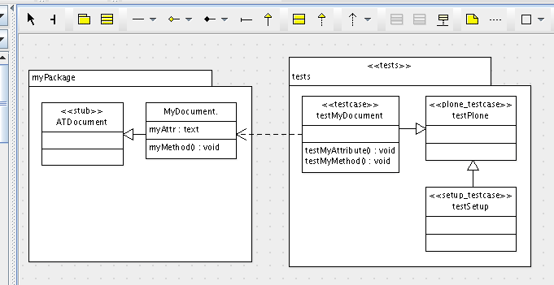

=====
Tests
=====

.. contents :: :local:

.. admonition:: Description

        Generation of tests from UML.

Overview
--------
We hope there is no need for us to emphasize how important testing is for even the most simple products you may be developing. This makes it especially useful to include the creation of both your testing framework and individual tests within your UML model.

Within a new package with a stereotype of ``<<tests>>`` you can create your base test case class with a stereotype of ``<<plone_testcase>>`` and a test setup class with a stereotype of ``<<setup_testcase>>``. You can then add additional test classes as needed with a stereotype of either ``<<testcase>`` or ``<<doc_testcase>>``.

Base Test Case
--------------
Creating a class in your tests package with a stereotype of ``<<plone_testcase>>`` generates the needed base test case for all other test cases.

Test Setup
----------
Creating a class in your tests package with a stereotype of ``<<setup_testcase>>`` generates a testcase for the setup, with pre-defined common checks.

Test Cases
----------
Test Case
^^^^^^^^^
Creating a class in your tests package with a stereotype of ``<<testcase>>`` generates a standard test case class.

Doc Tests
^^^^^^^^^
Creating a class in your tests package with a stereotype of ``<<doc_testcase>>`` generates a doc test file in the ``doc`` folder of your product with a name of ``class + .txt``. You can use the tag of ``doctest_name`` on your class (excluding any extension as ``.txt`` is appended automatically) to indicate a different name for your generated doc test.

Functional Tests
^^^^^^^^^^^^^^^^
Generate browser functional tests using the ``<<plonefunctional_testcase>`` stereotype.

Interface Tests
^^^^^^^^^^^^^^^
Generate interface tests using the ``<<interface_testcase>>`` stereotype.

It is unverified whether these generated test cases will verify Z3 style interfaces but stay tuned!
