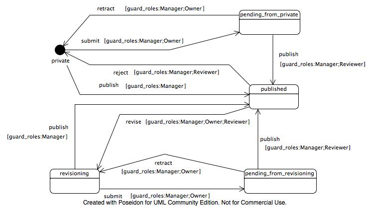

=========
Workflows
=========

.. contents :: :local:

.. admonition:: Description

        Usage of state diagrams to create custom workflows.

ArchGenXML can use state diagrams to generate workflows for a portal type. Workflows are used to set the various states an object can be in, and the transitions between them.

Importantly, workflows control permissions of objects. By convention, and for convenience and consistency, most content types will use the permissions found in the ``CMFCorePermissions`` class in the CMFCore product to control access to their methods. The methods generated by and inherited from the CMF and Archetypes frameworks adhere to this principle. Although many different content types use the same basic permissions to control access, workflows are the means by which you can control permissions for an object in detail. For instance, you may wish to specify that in the ``testing`` state, Manager and Reviewer has ``Modify portal content`` permissions, and Owner, Manager and Reviewer has ``View`` permissions. For the ``completed`` state, you could have a different set of permissions. See the DCWorkflow documentation for more details about how to use workflows.

Problems with UML-Software
--------------------------
The workflow implementation of ArchGenXML has to date only been tested with ArgoUML and Poseidon (tested Version is 3.1 and 3.2 CE).

ObjectDomain is known not to work at this time, because it does not appear to correctly export the XMI for state diagrams. If you have different experiences, please add a comment to this document or contact us.

Creating a workflow
-------------------
In your UML modeller, add a state diagram for the class you wish to create a custom workflow for. If you don't want to assign the workflow to a class use an class with stereotype ``stub``. In Poseidon, this is done by right-clicking on the object in the tree on the left hand side, and selecting to add a new state diagram. The name of the state diagram becomes the name of the workflow.

States
------
On the state diagram, add a state item (a rounded-corner box) for each state. You must have an initial state of your workflow for it to work correctly. Use a "initial state" symbol (filled cirlce) for the state your object defaults to after creation. Optional you can use a normal state item and set a tagged value ``initial_state`` with value 1 to it.

At present, ArchGenXML does not support the "final state" UML symbols to represent final states, so you should stick to the standard state symbols.

The names of your states in UML become the names of the states in your workflow. The user-visible label can be set with the ``label`` tagged value; it defaults to the state name.

Transitions
-----------
For each possible transition between states, add a transition arrow to your UML model. The name of the transition becomes the name of the workflow action. You can set the ``label`` tagged value on the transition to set a custom label to display to the user.

If a transition with the same name/target is used more than one time, you can use the stereotype ``<<primary>>`` to define its settings once and use it by name on all similar transitions.

Transition guards
^^^^^^^^^^^^^^^^^
You can add a guard to a transition to restrict to whom and when it is made available. Set the ``expression`` field of a transition to a \|-separated list of the following pairs:

**guard_roles**
    Set ``guard_roles:Owner; Manager`` to restrict the transition to users posessing the Owner or Manager role in the current context.
**guard_permissions**
    Set ``guard_permissions:My custom permission;View`` to ensure that only those users with ``My custom permission`` or ``View`` permissions in the current context are allowed to access the transition.
**guard_expr**
    Set ``guard_expr:expression``, where ``expression`` is a TALES expression, to have the expression be evaluated in order to determine whether the transition should be made available.

Thus, to restrict access to roles Reviewer and Manager, and only those users with permission ``My custom permission`` and ``View`` in the current context, you can set the expression of the transition to ``guard_roles:Reviewer;Manager|guard_permissions:My custom permission, View``.

If you are using Poseidon, transition guards are located in the property of the transition arrow with the name ``[A] Guard``. You can add an expression like the one outlined above to this field.

Permissions
^^^^^^^^^^^
ArchGenXML uses tagged values on states in a somewhat unconventional, though convenient, way to control permissions. With the exception of the special-case ``initial_state`` and ``label`` tagged values, you give the name of the permission as the tagged value key, and a comma-separated list of roles the permission should be enabled for as the value.

There are three shorthand permission names available:

**access**
    referes to the ``Access contents information`` permission,
**view**
    refers to the ``View`` permission,
**modify**
    refers to the ``Modify portal content`` permission,
**list**
    refers to the ``List folder contents`` permission.
**delete**
    refers to the ``Delete objects`` permission.

Hence, if you want your state to permit anonymous users and members to view your content, only permit managers to modify, and permit both the owner and managers to add new objects controlled by the ``Add MySubTypes`` permission, you can add tagged values to the workflow state::

    view           ==> Anonymous, Member
    modify         ==> Manager
    Add MySubTypes ==> Owner, Manager

If you want to aquire the permissions and add new ones you can use the value 'aquire'::

    view           ==> acquire, Anonymous, Member

(One special case: if you leave the value empty, no one gets that permission (which is logical), but it also explicitly unsets acquisition of the permission).

Workflow actions
----------------
The ``portal_workflow`` tool allows a script to be executed before and/or after a transition is completed. This is no longer supported. Instead subscribers to the Workflow events are used. Event-subsribers are more flexible.

Actions are set using the ``effect`` field of a transition. The value given here gives the name of the subscriber to execute (and thus must be valid python method name). ArchGenXML will create or modify a subscriber for each workflow-action in a file ``wfsubsribers.py`` in your product. You must fill in the method bodies for the actions in this file. Method bodies will be preserved upon re-generation of your product from the UML model. In Plone 2.5 compatible mode DCWorkflow needs a patch with a backport. This patch is generated, if ``2.5`` is selected as ``plone_target_version`` (tagged value on model).

By default, actions specified in this way are post-transition actions, meaning that they are executed after the transition has taken place. If you wish to specify a pre-transition action, executed before the transition takes place, separate action names by semicolons: ``preActionName;postActionName``. If you want only a pre-transition action, use ``preActionName;`` to specify that there is an empty post-transition action.

Attach workflow to more than one class
--------------------------------------
In UML there is no semantic to use a workflow for more than one class. We introduced the tagged value ``use_workflow`` for classes. Value is the workflow name.

Worklist support
----------------
You can attach objects in a certain state to a worklist. A worklist is something like the "documents to review" list you get when you're a reviewer in a Plone site. This is done by adding a tag ``worklist`` to the state with the name of the worklist as value (like ``review_list``).

You can add more than one state to a ``worklist``, just by specifying the same name for the worklist tagged value. Likewise, you can have more than one worklist (just not on the same state). The tagged value ``worklist:guard_permissions`` allows you to specify the permission you need to have to view the worklist. The default value is ``Review portal content``.
