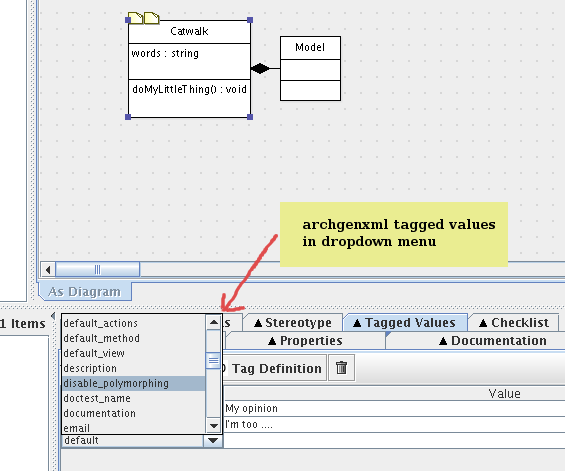

===============================================
Configure ArgoUML to use the archgenxml profile
===============================================

.. contents :: :local:

.. admonition:: Description

        ArgoUML can load a "definition" file with predefined tagged values and stereotypes. So you
        have all the custom tagged values and stereotypes used by ArchGenXML available in dropdown
        menus.

Background and Notes
--------------------
The screenshot below shows ArgoUML with the custom tags from the definition file. Having many of the possible options available from a menu has the following benefits:

* saves time - sometimes clicking is faster than typing
* reduces errors - no more mispelled tags
* presents a learning opportunity - seeing new tags and stereotypes provides a springboard for further investigation

This walks you through how a setup of ArgoUML on an Ubuntu desktop system. The methodology should be easily adjusted to other platforms.

Assumptions
^^^^^^^^^^^
These are my assumptions:

* You already have latest sun java JRE installed. You can get it on Ubuntu with::

   apt-get install sun-java6-jdk

If::

   update-alternatives --list java

don't give you */usr/lib/jvm/java-6-sun/jre/bin/java*, you can set java sun as the default java implementation like this::

   update-alternatives --set java /usr/lib/jvm/java-6-sun/jre/bin/java

* You have copied archgenxml_profile.xmi in the *<path to archgenxml>/profiles* directory like described in the previous section.

Install ArgoUML
^^^^^^^^^^^^^^^

Go to http://argouml.tigris.org and download the latest stable version of ArgoUML (0.28 when these lines are written). Download the exe for Windows, the tar.gz archive for Linux.

On Windows, execute the downloaded exe to install it.

On Linux, unpack the archive somewhere, a good location is '/opt'::

   $ sudo mkdir /opt
   $ cd /opt
   $ sudo tar xvf /tmp/ArgoUML-0.28.tar.gz

It should create a argouml-0.28 directory.

It is handy to symlink 'argouml.sh' to '/usr/local/bin/argouml'::

   $ sudo ln -s /opt/argouml-0.28/argouml.sh /usr/local/bin/argouml

Configure ArgoUML to use the definition file
^^^^^^^^^^^^^^^^^^^^^^^^^^^^^^^^^^^^^^^^^^^^

.. note::

   ArgoUML 0.24 used to use the argo.defaultModel option to specify a profile to use like this::

      java -Dargo.defaultModel=<path to archgenxml>/profiles/archgenxml_profile.xmi -jar /opt/ArgoUML/argouml.jar

   It's not the case anymore with latest ArgoUML version. Please read on.

* Launch ArgoUML and go to Edit -> Settings... -> Profiles
* Click on Add and specify your *<path to archgenxml>/profiles* directory.

.. note::

     archgenxml will use the list of profiles directories configured on ArgoUML.

* Close ArgoUML and launch it again.
* Go again in Edit -> Settings... -> Profiles AGXProfile should be visible now in "Available Profiles".
* Click on ">>" to add it to "Default profiles".
* You should remove the Java profile from the "Default profiles" list to be sure to not use stereotypes and tag definitions from this one. You should only have AGXProfile and UML 1.4 in this list. You can't remove the UML 1.4 here, but you remove it by project.

The global configuration is now done.

Now for every new project you create:

* Click on the fourth icon in the toolbar to configure Profiles for this project. Delete UML 1.4. You should really only have AGXProfile is this list.

.. note::

   if you want to generate Plone 2.5 compatible code, set on the model root the plone_target_version tag definition with value 2.5.

Why ArgoUML?
^^^^^^^^^^^^
Just a few notes on why using ArgoUML.

* Mature - it supports the important stuff (at least as far as ArchGenXML goes), state diagrams, tagged-values, stereotypes.
* It is pretty lightweight, which is important when your laptop only has 256 MB of RAM and a PIII 700 Mhz processor. Poseidon Community Edition, though nice, is just too memory hungry.
* Price is good (free and open source)
