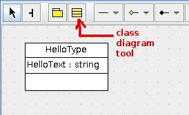
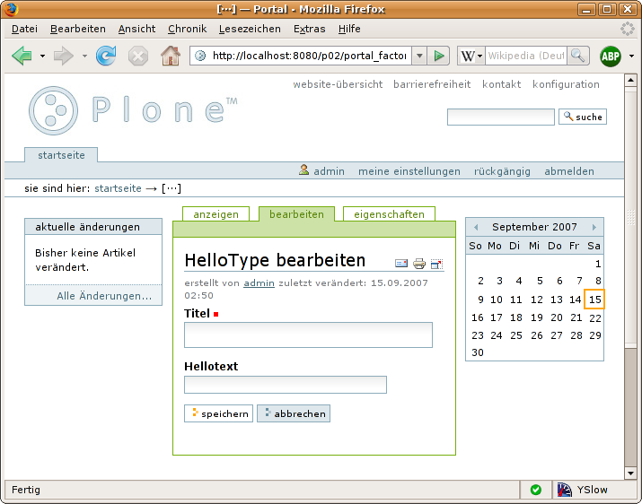

===========
Hello World
===========

.. contents :: :local:

.. admonition:: Description

    Create your first minimal content type with ArchGenXML

Open the UML tool of your choice. Make a new UML model and give it a name
``HelloWorld``. Then add a class diagram (most UML tools do this automatically).

Choose the tool for class creation and add a class to the diagram. Give it a
name such as ``HelloType`` and add an attribute ``HelloText`` with type
``string``. The `helloworld3.zargo <helloworld3.zargo>`_ (Plone 3.0) /
`helloworld25.zargo <helloworld25.zargo>`_ (Plone 2.5) models were created using
ArgoUML, and contain the type as described above.

Generating the product
======================

Save your model as ``helloworld.zargo`` (ArgoUML) or ``helloworld.zuml``
(Poseidon), or export it as an XMI file with the name ``helloworld.xmi``. Then
go to the command line and execute:

.. code-block:: console

   $ archgenxml helloworld.zargo

ArchGenXML will begin code generation. When it completes, you will have a new
folder ``HelloWorld`` on your file system. Its contents looks like::

   HelloWorld/
   |-- Extensions (only with plone_target_version=2.5)
   | |-- Install.py
   | `-- __init__.py
   |-- HelloType.py
   |-- __init__.py
   |-- config.py
   |-- configure.zcml
   |-- i18n
   | `-- generated.pot
   |-- interfaces.py
   |-- locales
   |-- profiles
   | `-- default
   | |-- HelloWorld_marker.txt
   | |-- cssregistry.xml
   | |-- factorytool.xml
   | |-- import_steps.xml
   | |-- jsregistry.xml
   | |-- metadata.xml
   | |-- skins.xml
   | |-- types
   | | `-- HelloType.xml
   | `-- types.xml
   |-- profiles.zcml
   |-- refresh.txt
   |-- setuphandlers.py
   `-- skins
   |-- helloworld_images
   | `-- HelloType.gif
   |-- helloworld_styles
   `-- helloworld_templates

Installing and using the generated product
==========================================

Move the whole folder ``HelloWorld`` to your Zope/Plone 3 instance's
``Products`` folder. Restart Zope, open Plone in a browser and log in as
Manager. Choose *Plone Setup* from the personal bar and choose *Add/Remove
Products*. A new product ``HelloWorld`` should now appear in the list of
products available for install. Choose it and click *install*. Go to your
personal folder. In the list of addable items, you'll find the content type 
from the new product. Add a test instance to see if it works.

That's the trick. By the way: the title is always part of the schema. But don't
worry: you can hide or recycle it later.
