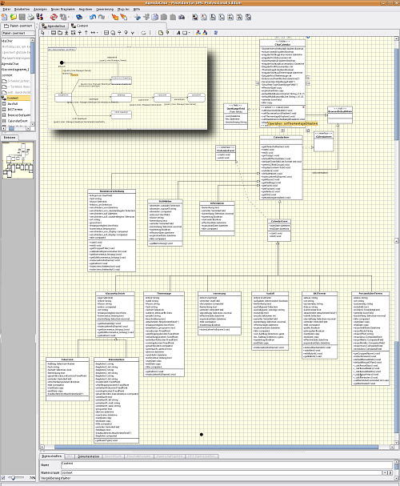

============
Introduction
============

.. contents :: :local:

.. admonition:: Description

        An introduction to ArchGenXML |---| what it is, reasons to use it, who made it.

What is ArchGenXML
==================

With ArchGenXML, you can create working Python code without writing one single
line of Python. It is a command-line utility that generates fully functional
Zope Products, based on the Archetypes framework, from UML models using XMI
(``.xmi``, ``.zargo``, ``.zuml``) files. The most common use-case is to
generate a set of custom content types and folders, possibly with a few tools,
a member type and some workflows thrown in.

In practice, you draw your UML diagrams in a tool which has the ability to
generate XMI files, like ArgoUML or Poseidon. Once you are ready to test your
product, you run ArchGenXML on the XMI file, which will generate the product
directory. After generation, you will be able to install your product in Plone
and have your new content types, tools and workflows available.

At present, round-trip support is not implemented: custom code can't be
converted back into XMI (and thus diagrams). However, you can re-generate your
product over existing code; method bodies and certain "protected" code sections
will be preserved. This means that you can evolve your product's public
interfaces, its methods and its attributes in the UML model, without fear of
losing your hand-written code.

ArchGenXML is hosted at `svn.plone.org <http://svn.plone.org/svn/archetypes/ArchGenXML/>`_
as a subproject of the Archetypes project. It is released under GNU General
Public Licence 2 or later.

Why should I use ArchGenXML?
============================

Major reasons:

* You want to save time
* You are a lazy programmer
* You don't like to reinvent the wheel
* You don't like copying and pasting code (and bugs)
* You make heavy use of references and interfaces
* You have big projects with many different custom types
* You want or need a well-documented interface to your product
* You like structured model- and pattern-driven software development
* You want to maintain your project in future without getting a headache

and many other good and odd reasons.

Contributors
============

The project was initially started by Phil Auersperg. Thanks to his laziness :-)

Authors
-------

**Phil Auersperg (Project Leader)**
   BlueDynamics Alliance, Auersperg-Castell KEG, phil@bluedynamics.com,
**Jens Klein (Release Manager, Developer and Doc-Writer)**
   BlueDynamics Alliance, Klein & Partner KEG, jens@bluedynamics.com,
**Reinout van Rees (Co-Release Manager, Developer and Doc-Writer)**
   ZestSoftware
**Fabiano Weimar dos Santos (Ideas, Testing, Bugfixing, Workflow)**
   Weimar Desenvolvimento e Consultoria em Informatica Ltda., xiru@xiru.org,
**Martin Aspeli (Improvements, bug fixes and documentation)**
   Martin Aspeli
**Robert Niederreiter (Lots of base work on AGX 2.0)**
   Robert Niederreiter
**and others**
   thanks to everybody who contributed with testing, doc-writing or code-pieces!

Sponsors
--------

* Xiru.org, Brazil (Fabiano Weimar dos Santos) sponsors a valuable amount of
  money into workflow support (State diagrams -> DCWorkflow, will go into release
  1.2),
* PilotSystems, Paris, France (David Sapiro),
* OpenSource.ag, Innsbruck, Austria (Georg Pleger).

.. TODO:: "will go"?
.. TODO:: hyperlink companies

If you want to contribute ArchGenXML by improving the code, helping with
documentation or sponsoring it to make us improve it, please contact one of
us.

.. |---| unicode:: U+02014 .. em dash
