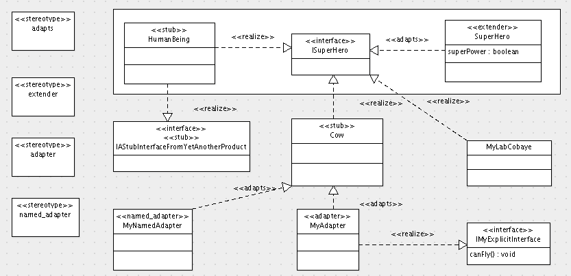

=========================
archetypes.schemaextender
=========================

.. contents :: :local:

.. admonition:: Description

        When you want to add a couple of fields to an existing content type
        (including reference fields), you may decide to create a whole new
        product that subclasses that type. You then have a whole bunch of code
        to maintain and you are dependent on changes that may occur in your
        parent class. Or you let ArchGenXML make your product use
        archetypes.schemaextender and your day gets brighter.

Prerequisites
-------------
You must install the `archetypes.schemaextender <http://pypi.python.org/pypi/archetypes.schemaextender>`_ product.

Adding a field to an existing content type
------------------------------------------
Let's say you want to add *superPower* (a field) to *HumanBeing*

(a class).

1. Let the content type to extend, e.g. *"HumanBeing"*, be present in your diagram (as a **class**, possibly with the ``<<stub>>`` stereotype)
2. Create an **interface**, e.g. *"ISuperHero"* (the "I" helps remembering this is an interface), in your diagram ; it has the ``<<interface>>`` stereotype
3. Draw a **realization** arrow from *"HumanBeing"* to *"ISuperHero"*
4. Create a **class**, e.g. *"SuperHero"*, in your diagram and give it the ``<<extender>>`` stereotype
5. Add any **field** (s), e.g. *"superPower"*, to this extender
6. Create a **realization** arrow from the extender class to the interface, e.g. from *"SuperHero"* to *"ISuperHero"*, remove its ``<<realize>>`` stereotype and replace it with a ``<<adapts>>`` stereotype
7. Generate & Done

Now every new instance of *HumanBeing* will have the *superPower* field in its schema, default view and default edit form. And even if the developer of the *HumanBeing* content type decides to remove its arms or legs, human beings (all of them) will still have super powers because you declared they are super heros (they implement *ISuperHero*).

Note that, in order to add these stereotypes (``<<extender>>``, ``<<adapts>>``) to your (Argo)UML model, you have to create a stereotype, give it the proper name (extender, adapts) and select its proper "Super-class" in the properties tab (you either select class for class stereotypes, or abstraction for the "adapts" stereotype).

Example model and additional features
-------------------------------------
AGX support of archetypes schemaextender is illustrated by the example model in the screenshot below :

You may note from this example model that AGX support of archetypes.schemaextender comes with a bunch of funny features :

* support for `adapters and named adapters <http://plone.org/documentation/tutorial/borg/a-whirlwind-tour-of-zope-3/>`_
* adapted interfaces (or classes) can be external to your model (using the ``<<stub>>`` stereotype)
* you can even let a stub class implement a stub interface : in the example above, the *HumanBeing* stub class has a realization arrow to *IAStubInterfaceFromYetAnotherProduct*, which will be turned by AGX into a five:implement ZCML declaration. This is useful when you want to integrate 2 distinct third party products via your own product. Your model is then nothing more than a "glue" model, which is a good thing in many cases.
