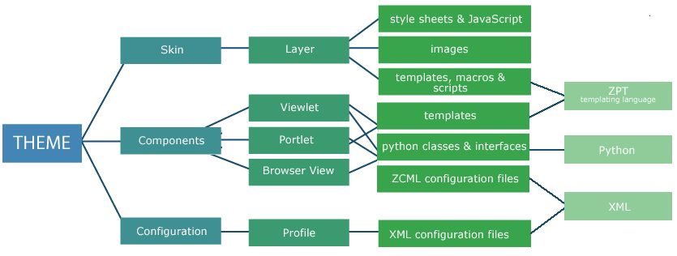

Overview
========

An overview of the building blocks and how they fit together to create a
theme.

There are really three main building blocks in a theme. The diagram
below shows you how these slot together:

Skin
----

-  deals with the overall construction of a page and the delivery of
   content
-  comprises page templates, macros, and Python scripts, and is also the
   place to put style sheets and JavaScript
-  to help you understand these we'll point you in the direction of
   tutorials on the templating language TAL and introduce you to skin
   layers and order of precedence
-  to find skin elements, look in

   -  portal\_skins in the Zope Management Interface
   -  the skins directory in a file system product

Components
----------

-  the Components part deals (mostly) with page furniture - the page
   elements which have some level of consistency from page to page along
   with page elements involving a level of processing - such as the
   navigation tree, RSS feeds
-  deploys a mixture of Python classes and page templates to create
   viewlets, portlets and browser views
-  to help you understand these, we'll give you an overview of how they
   are wired together with ZCML, and we'll give you the briefest of
   introductions to the bits you really need to know about Python
   classes
-  to find the pieces that go together to make a component, look in

   -  portal\_view\_customizations in the Zope Management Interface
   -  the browser directory in a file system product

Configuration
-------------

-  the Configuration part deals with setting the order of some page
   elements (or individual items) on the page and with automatically
   setting some of the configuration you would otherwise make manually
   through the Site Setup interface
-  to help you understand the configuration, we'll point you in the
   direction of the main tools for manual configuration, give you a
   quick overview of the Generic Setup Tool and the XML used for
   automatic configuration
-  configuration tools are found in several places in the site, but the
   files required to run a configuration automatically are found in the
   profiles directory of a file system product

