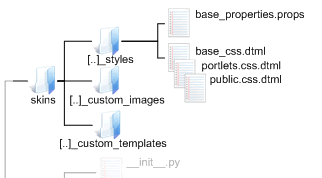
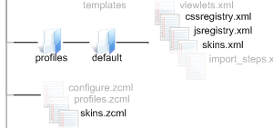

Where to find what you need
===========================

Where the skin lives in Plone and in your own theme product.

Through the Web
---------------

You can customize all page templates, skins and CSS very easily through
the web.

-  Site Setup > Zope Management Interface > portal\_skins

Locate the item you want to change, click the customize button and a
copy will be dropped into the custom layer for you.

You can also add new page templates, Python scripts and files (for CSS
and JavaScript) to the custom layer by using the drop-down list in the
ZMI. In most cases, though, you will find it easier to locate a template
you want to base your new template on, customize it and then rename it
through the ZMI.

Don't forget that, if you're hunting for something, the Find tab in the
ZMI can be very useful.

Plone Default Skin on the File System
-------------------------------------

All the page templates, style sheets, scripts and JavaScript for the
Plone Default skin can be found in the CMFPlone product:

[your products directory]/CMFPlone/skins
    You'll see there are a number of directories corresponding to
    specific skin layers. Most of this should be self-explanatory, but
    its worth remembering that only the generic templates live in
    plone\_templates. If you want to track down a specific content view
    (e.g., document\_view) then you'll need to look in plone\_content.

In your own Theme Product
-------------------------

|The skins folder in your theme product|    

/skins/[your theme namespace].[your theme name]\_custom\_templates \|
 custom\_images \| styles

    These directories will form your skin layers. Your templates,
    images, and style sheets can go here. If you asked it to, the
    plone3\_theme paster template will have provided blank style sheets
    to override the Plone Default ones.

/skins.zcml 
    When your Zope instance starts up, this turns your directories into
    skin layers

|Subsidiary files used for installing and setting up the Skin|

/profiles/default/skins.xml \| cssregistry.xml \| jsregistry.xml

    When your theme is installed in your Plone site, these set up the
    hierarchy of skin layers, and register your style sheets and
    JavaScript with the registries

 

