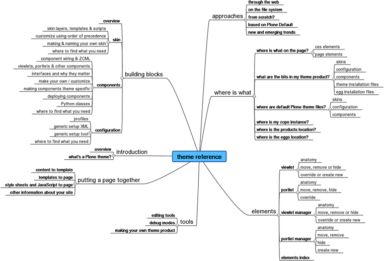

Overview
========

Here's a quick overview of what this manual covers.

Section 1: Introduction

A theme is a distinct look and feel for Plone, which is often based
structurally on the out-of-the box Default Plone theme.

Section 2: Approaches

What's the best way to go about it - what are the pros and cons of
working through the web or on the file system?

Section 3: Tools

What tools are required and what's available to help you build your
theme?

Section 4: Building Blocks

There are three main building-blocks in a Plone 3 theme. While there are
a few overlaps between them, in general, it helps to see them as
discrete entities.

-  skin
-  components
-  configuration

This section will give you an overview of

-  the terminology involved in each of these building blocks
-  the languages you'll need to work with each of them
-  the techniques / approaches required to customize these building
   blocks or create new ones
-  how you can locate the files you need

Section 5: Putting a Page Together

How is everything pulled together to create a page? We'll look at

-  how a page is constructed
-  how content reaches the page
-  how style sheets and JavaScript reach the page
-  how you can get hold of other information about your site

Sections 6: Elements Reference

There's a quick reference to page elements and a brief summary of how to
tackle customization and creation of components.

Section 7: Where is What?

It's often difficult to identify the location of the files you need.
This section gives you a quick reference to the file layout of a theme
product. There are also pointers to other diagrams on the web which
should help you to map the visual page elements to components, templates
and styles.
