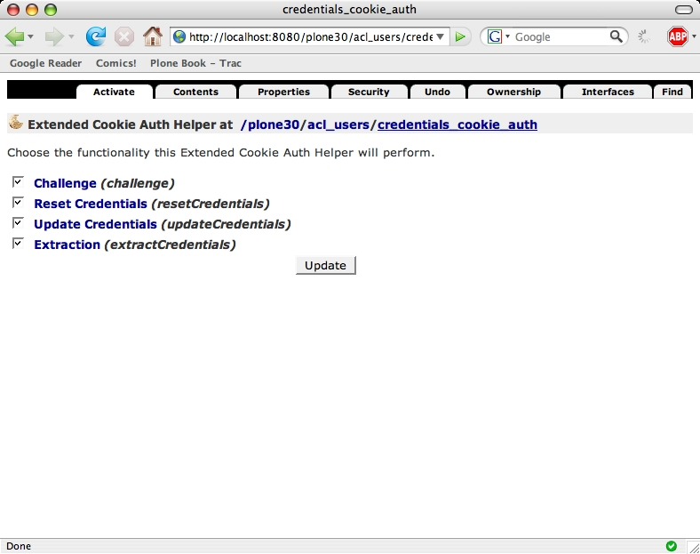
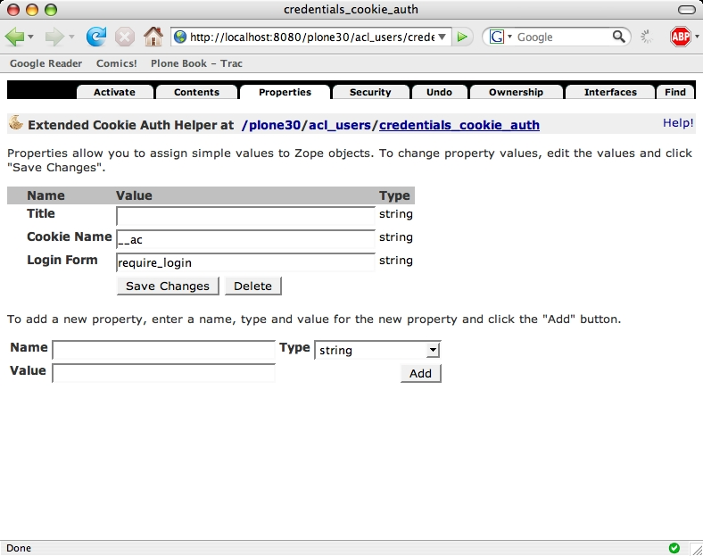

====================================
Configuring an individual PAS plugin
====================================

.. contents:: :local:

.. admonition:: Description

    In addition to enabling and disabling plugins via the plugins object
    each plugin can also have its own configuration.
    You can access this by opening a plugin in the ZMI.

Taking the ``credentials_cookie_auth`` as example again you will see the
screen for the :guilabel:`Activate` tab.
This tab is mandatory and allows you to enable and disable PAS interfaces
for a plugin.
This corresponds to the plugin configuration we saw earlier, but does not
allow you to change the ordering of different plugins for an interface.
If you enable a new interface for a particular plugin, it will be
activated and placed last in the list of plugins for a particular
interface.

You can also go to the :guilabel:`properties` tab to edit settings
specific for this plugin:

What you can configure will differ per plugin. Some plugins do not have
any configurations options, others can be very complex.
