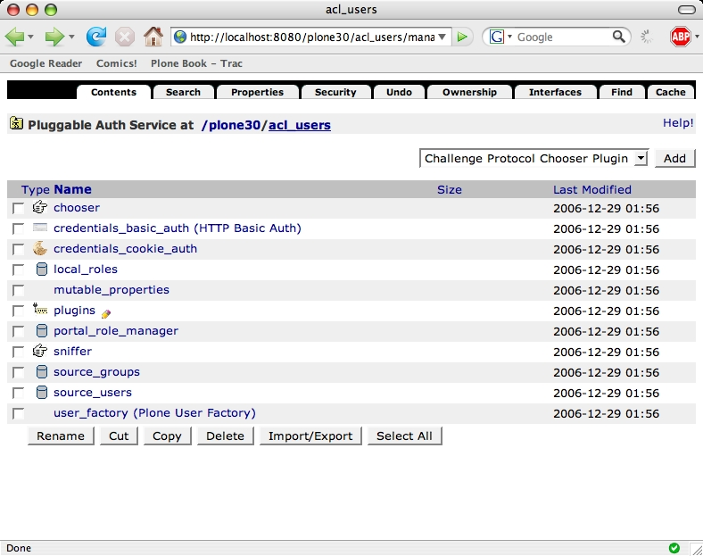
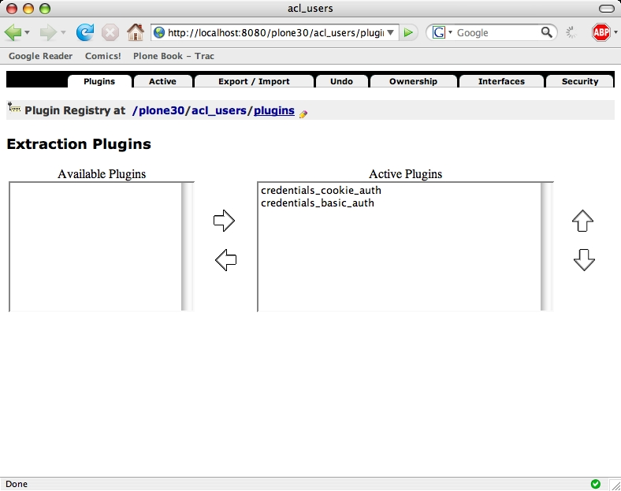

===============
Configuring PAS
===============

.. contents:: :local:

.. admonition:: Description

    There is no Plone interface to configure PAS:
    you will need to use the Zope Management Interface (:term:`ZMI`).
    In the ZMI you will see a ``acl_users`` folder in the site root.
    This is your PAS object.

If you open the ``acl_users`` folder you will see 
a number of different items.
Each item is a PAS plugin, which implements some PAS functionality.

There is one special item: the ``plugins`` object manages 
all administrative bookkeeping within PAS.
It remembers which interfaces are active for each plugin 
and in what order the plugins should be called.

Let's take a look to see how this works.
If you open the ``plugins`` object 
you will see a list of all the PAS interfaces,
along with a short description of what they do.

We will take a look at the extraction plugins.
These plugins take care of extracting the credentials 
such as your username and password from a request.
These credentials can then be used to authenticate the user.
If you click on the Extraction Plugins header you will see 
a screen which shows the plugins which implement this interface 
and allows you to configure which plugins will be used and in what order.

In the default Plone configuration there are two plugins enabled for this
interface:

* the ``credentials_cookie_auth`` plugin can extract the login name and
  password from an HTTP cookie and HTTP form values from the login form or
  portlet;
* the ``credentials_basic_auth`` plugin can extract the login name and
  password from standard HTTP authentication headers.

In the default configuration the cookie plugin takes preference over the
basic authentication plugin.
This means that credentials from a HTTP cookie will be preferred over
credentials from HTTP authentication headers if both are present.
You can try this by first logging in using standard
HTTP authentication in the Zope root, and then visiting your Plone site
and logging in with a different user there: you will see that the new user
is now the active user.

You can change the order of the plugins by clicking on a plugin and moving
it up or down with the arrows. Using the left and right arrows you can
enable and disable a plugin for this interface.
