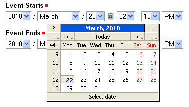

Adding Events
=============

.. include:: ../../_robot.rst

Plone web sites have a built-in system for managing and showing calendar
events.

Use the *Add new...* menu for a folder to add an event:

.. replaces ../../_static/copy_of_addnewmenu.png
.. figure:: ../../_robot/adding-events_add-menu.png
   :align: center
   :alt: add-new-menu.png

.. code:: robotframework
   :class: hidden

   *** Test Cases ***

   Show add new event menu
       Go to  ${PLONE_URL}

       Click link  css=#plone-contentmenu-factories a

       Wait until element is visible
       ...  css=#plone-contentmenu-factories li.plone-toolbar-submenu-header

       Pause

       Mouse over  event
       Update element style  portal-footer  display  none

       Pause

       Capture and crop page screenshot
       ...  ${CURDIR}/../../_robot/adding-events_add-menu.png
       ...  css=div.plone-toolbar-container
       ...  css=#plone-contentmenu-factories ul

Select **Event** from the drop-down menu, and you'll see rather large *Add Event* panel:

.. figure:: ../../_static/addevent.png
   :align: center
   :alt: Add Event

From the top, we have the following fields:

-  *Title* - **REQUIRED**
-  *Description*
-  *Event location*
-  *Start date and time* - **REQUIRED**
-  *End date and time* - **REQUIRED**
-  *Event body text* (visual editor panel)
-  *Attendees*
-  *Event type(s)*
-  *Event URL*
-  *Contact Name*
-  *Contact Email*
-  *Contact Phone*
-  Change note

Note that only three fields, title and start and end date and time, are
required. So, although this is a large input panel, if you are in a
hurry, just type in the title and the start and end times and save. Of
course, if you have the other information, you should type it in.
One part of the panel needs a bit more explanation: the event start and
end times. The year, month, day, and other fields are simple pull-down
menus. But for the day, often you can't remember exactly and you need to
consult a calendar. There is a handy pop-up calendar that offers an
alternate way to select the day. If you click one of the little calendar
icons adjacent to the day pull-down, :

.. figure:: ../../_static/eventstartandendfields.png
   :align: center
   :alt:

you'll see this pop-up calendar:

Just click the day and it will be set. Fill in the fields for which you
have information and save the event, but remember:

**IMPORTANT:***It will not show on the main web site calendar until it
has been **published*****.
**

.. robotframework::
   :creates: ../../_robot/adding-events_add-menu.png
